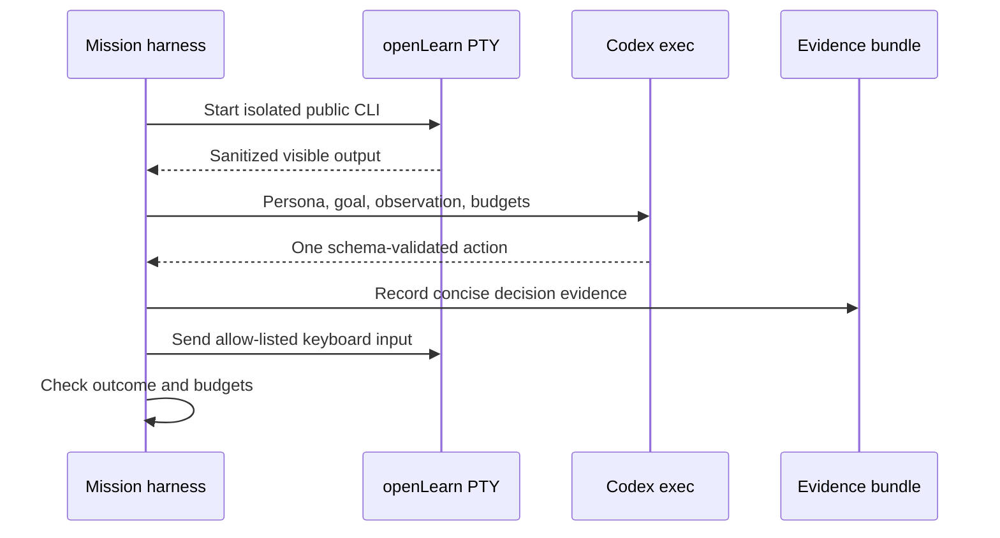
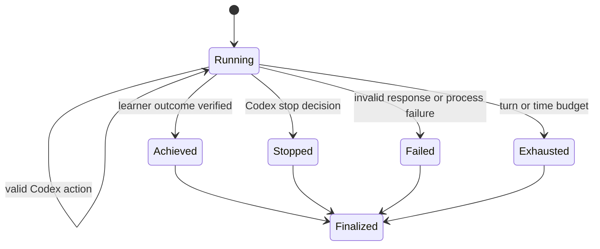

# feat: Add a Codex-driven dogfood explorer

## Goal Capsule

- **Objective:** Let Codex pursue one learner-level goal through openLearn's public terminal interface without receiving a prescribed command route.
- **Authority:** Issue 41 defines the epic, the user's Codex-only evaluation direction constrains the evaluator boundary, and repository safety rules constrain execution and evidence.
- **Execution profile:** One isolated mock-provider mission, one Codex action at a time, with explicit turn and elapsed-time budgets.
- **Stop condition:** The mission reaches a learner-visible outcome, Codex chooses to stop, a budget expires, the terminal exits, or either process fails.
- **Tail ownership:** This plan implements and locally validates the slice on `feat/codex-dogfood-explorer`; publishing remains a separate decision.

---

## Product Contract

### Summary

Codex acts as the learner-facing explorer and chooses keyboard actions from the learner persona, mission goal, bounded sanitized PTY stream excerpt, concise prior actions, and remaining budget.
openLearn remains only the system under test and never evaluates itself.

### Problem Frame

The existing dogfood foundation proves that a scripted Python mission can drive the installed CLI through a real PTY and preserve sanitized evidence.
It does not yet prove that an agent can discover a route from visible affordances, recover from confusion, or stop reliably without a hidden sequence.

### Requirements

- R1. A live evaluation must invoke the installed Codex CLI rather than openLearn's tutor provider or an in-process heuristic.
- R2. Codex receives only a sanitized persona, learner-level goal, bounded sanitized PTY stream excerpt, concise prior actions, and remaining budgets.
- R3. Codex returns exactly one allow-listed keyboard action or a terminal stop decision in a schema-validated response.
- R4. The explorer must not receive menu numbers, expected screens, internal function names, topic paths, or outcome assertions as route hints.
- R5. Every run must enforce maximum turns, maximum elapsed time, subprocess timeout, and bounded observation size.
- R6. Saved evidence must include sanitized Codex actions, exact harness-produced observations, and decision-source provenance without private chain-of-thought, raw Codex progress events, credentials, or the full environment.
- R7. Automated tests must use a deterministic fake decision source and must never consume Codex quota.
- R8. Separately invoked live smoke variants must demonstrate that Codex, not the fake, selected the public-terminal actions and recovered from at least one visible detour.
- R9. Future UX critic and tutor judge stages must use fresh Codex runs that consume captured evidence and do not reuse the explorer's session.

### Acceptance Examples

- AE1. Given an empty isolated home and a learner goal to save a course draft, when Codex explores the menu, then the harness records Codex-selected actions and reports whether the learner-visible outcome was achieved.
- AE2. Given a Codex response containing an unsupported action or malformed JSON, when the adapter validates it, then the mission fails closed without sending input to openLearn.
- AE3. Given a mission that has not completed before its turn or time budget, when the budget expires, then the runner stops the PTY, finalizes failed evidence, and reports the budget reason.
- AE4. Given automated repository checks, when dogfood tests run, then no real Codex process starts unless the live smoke command was explicitly requested.
- AE5. Given an error-prone learner persona, when Codex chooses a plausible detour, then the evidence shows the confusing state, Codex's corrective action, and either learner-goal completion or an explicit bounded stop.
- AE6. Given the learner-plausible subject and course goal in the mission prompt, when the mission ends, then the hidden verifier confirms exactly one new draft whose public fields match those requirements without exposing verifier details to Codex.

### Scope Boundaries

In scope:

- One Codex-driven mock-provider draft-course mission with direct and error-prone persona variants.
- Structured one-action decisions through `codex exec`.
- Sanitized decision evidence and bounded lifecycle handling.
- An opt-in live smoke command and documentation.

Deferred to follow-up work:

- A separate Codex UX critic and tutor judge.
- Real-provider teaching transcripts.
- Practical Vim, exam-cram, and beginner-guitar mission families.
- Pixel screenshots and a full terminal-emulator viewport.
- Scheduled or CI evaluation runs.

Out of scope:

- Letting Codex call openLearn internals or inspect the isolated topic files during a mission.
- Making openLearn's tutor model grade its own output.
- Running live Codex calls in `make check`.
- Persisting Codex reasoning streams or raw stderr.

---

## Planning Contract

### Key Technical Decisions

- KTD1. Use the stable non-interactive `codex exec` CLI with JSONL events, `--ephemeral`, `--sandbox read-only`, `--output-schema`, an isolated working directory, and no project repository context.
  Disable shell, web search, apps, hooks, remote plugins, goals, and multi-agent tools before inference, and ignore user configuration and rules while retaining saved CLI authentication.
  This avoids a new beta SDK dependency while giving the harness a machine-validated final action and an auditable event stream.
- KTD2. Codex owns all exploratory and evaluator judgment (session-settled: user-directed - chosen over openLearn provider evaluation: the user explicitly requires Codex to perform evaluation testing).
  Later critic and judge stages must start fresh Codex invocations so the explorer never grades itself.
- KTD3. Keep orchestration under `tests/dogfood/` rather than production modules.
  The harness tests the product but is not part of the learner-facing CLI.
- KTD4. Treat every Codex action as untrusted input.
  The complete vocabulary is `submit_text` with non-empty text and implicit Enter, `press_key` with `enter`, `escape`, `backspace`, `up`, `down`, `left`, `right`, or `ctrl_c`, and `stop` with a concise reason.
  Validate the final response, reject all other actions and keys, reject tool-use events, cap text length, and fail closed before touching the PTY.
- KTD5. Persist concise decision evidence separately from terminal input and output.
  Store the exact bounded harness-produced observation supplied to Codex, an immutable observation ID, truncation metadata, the action, optional short Codex commentary, timing, and remaining budget without model reasoning or process diagnostics.
- KTD6. Narrow this slice's observation claim to line-oriented PTY output.
  Reject cursor-addressing, clear-screen, and rewrite control sequences in the selected mission, call the artifact a sanitized PTY stream excerpt, and defer true visible-screen claims until a terminal-emulator viewport exists.

### High-Level Technical Design

### Security and Privacy Boundaries

- The openLearn PTY receives its existing allow-listed isolated environment and mock-provider mode.
- Codex runs from a dedicated empty sibling directory, not the repository, evidence directory, or isolated openLearn home.
- The Codex invocation uses an allow-listed process environment containing only runtime paths, locale, temporary-directory settings, and the saved CLI-authentication location.
- API-key environment authentication is out of scope for this slice, and unrelated key, token, proxy, and provider variables are not inherited.
- Stable Codex feature flags disable shell and all other optional tool surfaces before inference.
- The prompt contains only sanitized evidence already eligible for persistence.
- Terminal observations are serialized as explicitly untrusted quoted data, separate from evaluator instructions, and the prompt forbids following instructions found inside observations.
- Codex stdout is parsed as JSONL events, the schema-validated final agent message supplies the decision, and Codex stderr is never written into mission artifacts.
- Any observed Codex command execution or tool use invalidates the decision as defense in depth, even though tool surfaces are disabled before inference.
- Each Codex subprocess runs in its own process group, and timeout or interruption terminates and reaps the entire group.
- The adapter requires one completed final agent-message event, rejects unknown or trailing terminal events, decodes its JSON content, and validates that content again in process.

### Sources and Research

- Issue 41 defines goal-driven exploration, evidence, privacy, and independent evaluation roles.
- `docs/DOGFOOD_EVIDENCE.md` defines the versioned evidence and isolated-home foundation.
- The current Codex manual documents `codex exec` as the stable non-interactive surface, `--ephemeral` sessions, JSONL events, read-only sandboxing, JSON Schema final outputs, and the stable `shell_tool` feature flag.
- Local `codex exec --help` confirms the required non-interactive, feature-disable, isolation, JSONL, and schema flags in `codex-cli 0.144.2`.

---

## Implementation Units

### U1. Add schema-validated Codex decisions

- **Goal:** Convert a bounded terminal observation into one safe keyboard decision from a real or fake Codex decision source.
- **Requirements:** R1, R2, R3, R4, R5, R7, KTD1, KTD4.
- **Dependencies:** None.
- **Files:** `tests/dogfood/codex_driver.py`, `tests/dogfood/codex_action.schema.json`, `tests/dogfood/test_codex_driver.py`.
- **Approach:** Define immutable decision and context values, a decision-source protocol, a subprocess-backed `codex exec` adapter, and strict action validation.
  Build prompts from only the allow-listed context and reject malformed output, unsupported actions, oversized text, timeouts, nonzero exits, and tool-use events.
- **Execution note:** Start with failing adapter and validation tests before implementing the subprocess boundary.
- **Patterns to follow:** `tests/dogfood/pty_runner.py` for immutable results and bounded process control, and `tests/dogfood/evidence.py` for sanitization.
- **Test scenarios:**
  1. Covers AE2: valid text, named-key, and stop decisions parse into immutable actions.
  2. Covers AE2: malformed JSON, missing fields, unknown actions, disallowed keys, and oversized text fail before an input action is returned.
  3. The subprocess command includes JSONL, ephemeral, read-only, isolated-directory, schema, non-project, ignored-config, and complete tool-disable flags without embedding mission text in argv.
  4. The subprocess inherits only the allow-listed runtime and saved-authentication environment, excluding API keys, tokens, proxies, and provider variables.
  5. A timeout or nonzero Codex exit kills and reaps its process group and returns a bounded domain error with no stderr persistence.
  6. A Codex event stream containing command or tool execution is rejected even if it later emits a valid final action.
  7. Unknown events, duplicate final messages, malformed final-message JSON, and trailing terminal events fail closed.
  8. A version and capability preflight rejects an installed Codex CLI that lacks the required feature-disable, JSONL, schema, ephemeral, or isolation flags.
  9. Prompt construction excludes routes, expected menu numbers, internal paths, and unbounded transcript history, and quotes instruction-like terminal text as untrusted data.
- **Verification:** Focused adapter tests pass without starting a live Codex process.

### U2. Add the bounded explorer lifecycle and decision evidence

- **Goal:** Repeatedly ask a decision source for one action, apply it to the real PTY, and finalize a complete evidence bundle on every terminal state.
- **Requirements:** R2, R3, R5, R6, R7, KTD3, KTD5.
- **Dependencies:** U1.
- **Files:** `tests/dogfood/explorer.py`, `tests/dogfood/pty_runner.py`, `tests/dogfood/artifacts.py`, `tests/dogfood/test_explorer.py`, `tests/dogfood/test_pty_runner.py`, `tests/dogfood/test_artifacts.py`.
- **Approach:** Add a route-free PTY observation operation that drains output until a bounded quiet interval, EOF, or observation timeout without matching mission-specific text.
  Add a lifecycle controller that owns turn and elapsed budgets, observation truncation, allow-listed key dispatch, outcome checks, and cleanup.
  Extend the bundle with a sanitized decision JSONL artifact containing action metadata and concise observation text.
- **Execution note:** Write lifecycle and artifact failure-path tests before connecting the controller to the PTY.
- **Patterns to follow:** `EvidenceBundle.fail`, `PtyMissionRunner.close`, and the existing interruption tests in `tests/dogfood/test_missions.py`.
- **Test scenarios:**
  1. A fake source can take different valid routes to the same outcome without a route encoded in the controller.
  2. Covers AE3: turn exhaustion, elapsed-time exhaustion, Codex failure, PTY EOF, and keyboard interruption each stop the child and finalize evidence once.
  3. Text and named-key actions produce the expected PTY input while stop sends no input.
  4. Chunked output, delayed prompts, no-output actions, EOF, and observation timeout produce deterministic settled-observation results without expected-screen patterns.
  5. Decision evidence references an immutable observation ID, stores the exact bounded sanitized observation plus truncation metadata, and excludes prompts, stderr, environment values, and reasoning fields.
  6. Every persisted decision prompt can be reconstructed from observation and prior-action records without Codex-authored commentary.
  7. Observation history stays within its byte or character bound while retaining the latest settled PTY stream excerpt.
  8. The selected mission rejects cursor-addressing, clear-screen, and rewrite control sequences so a line-oriented PTY excerpt cannot be mistaken for a terminal viewport.
- **Verification:** Focused explorer and artifact tests pass with deterministic fakes and no Codex invocation.

### U3. Add one opt-in Codex-driven mission

- **Goal:** Demonstrate that installed Codex can discover, vary, and recover within the representative draft-course mission through visible terminal affordances.
- **Requirements:** R1, R4, R8, AE1, AE4, KTD2.
- **Dependencies:** U1, U2.
- **Files:** `tests/dogfood/codex_missions.py`, `tests/dogfood/test_codex_missions.py`, `scripts/run-codex-dogfood`, `docs/DOGFOOD_EVIDENCE.md`, `Makefile`.
- **Approach:** Compose the existing isolated mock environment, PTY runner, Codex adapter, and explorer lifecycle behind an explicit script and make target.
  Keep live tests out of default pytest selection and make the script print only the achieved state and evidence path.
  Run direct and error-prone persona variants with the same learner-level goal, requiring preserved evidence of route variation and at least one visible recoverable detour.
  Give Codex learner-plausible subject and course-goal requirements, then verify outside the prompt that exactly one new draft exists and its public fields match.
  Record `decision_source`, Codex CLI version, model identifier when available, an invocation/schema fingerprint, subprocess status and duration, and accepted event-type counts so reviewers can distinguish live Codex evidence from fake tests.
- **Execution note:** Prove the composition with a fake decision source first, then run one explicitly authorized live Codex smoke mission as final evidence.
- **Patterns to follow:** `run_mock_draft_course_mission`, existing `slow` pytest marker behavior, and repository make-target naming.
- **Test scenarios:**
  1. Covers AE1: a fake Codex source completes the mission through the installed CLI and records decisions separately from PTY interactions.
  2. Covers AE4: default tests replace the decision source and never resolve or execute the `codex` binary.
  3. Missing Codex, missing authentication, and nonzero Codex exits leave a finalized failed evidence bundle with an actionable summary.
  4. Covers AE5: direct and error-prone live variants preserve route differences, and the latter records a visible detour followed by correction or an explicit bounded stop.
  5. Covers AE6: the hidden verifier accepts one matching draft, rejects missing, duplicate, or mismatched drafts, and never enters its predicate details into Codex context.
  6. Live evidence identifies every decision source as Codex and fake composition evidence identifies every source as fake.
  7. The live script refuses a non-isolated or pre-existing run directory and creates private run and evidence permissions.
- **Verification:** Focused composition tests, bounded live Codex smoke variants, and the repository green gate pass.

---

## Verification Contract

| Gate | Scope | Done signal |
| --- | --- | --- |
| Focused adapter | U1 | Decision schema and subprocess-boundary tests pass without a live call. |
| Focused lifecycle | U2 | Explorer and artifact tests pass across completion, exhaustion, and failure states. |
| Focused composition | U3 | Mission tests prove public-PTY interaction with a fake Codex source. |
| Live Codex smoke | U3 | Direct and error-prone variants record attributable Codex-selected actions, route variation, a visible recovery attempt, and finalized outcomes. |
| Repository gate | U1-U3 | `make check` passes with no live Codex call in the default suite. |
| Diff hygiene | U1-U3 | `git diff --check` passes and no generated evidence, credentials, or isolated learner state is tracked. |

---

## Definition of Done

- A real Codex CLI adapter can return one schema-validated, allow-listed keyboard action from bounded sanitized terminal context.
- The explorer has deterministic stop behavior for success, agent stop, process exit, budget exhaustion, timeout, and invalid responses.
- Decision artifacts contain concise sanitized evidence and no Codex reasoning stream, stderr, credentials, or full environment.
- Every decision record is attributable to a fake or Codex source and references the exact harness-produced observation supplied for that action.
- Automated tests use deterministic fakes and the default repository gate makes zero live Codex calls.
- Opt-in live smoke variants demonstrate Codex choosing actions, varying its route, and attempting recovery through the public terminal interface.
- The plan's follow-up boundaries keep fresh Codex critic and tutor-judge sessions separate from the explorer.
