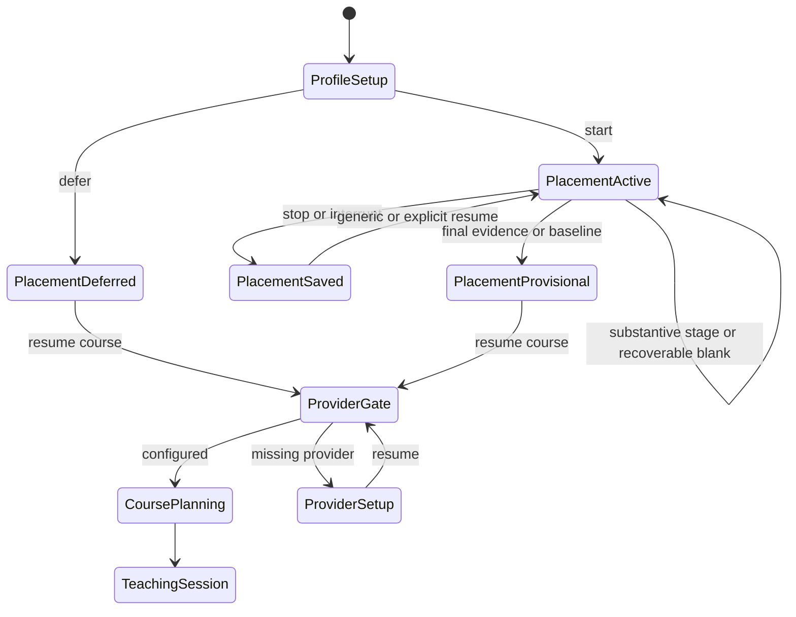
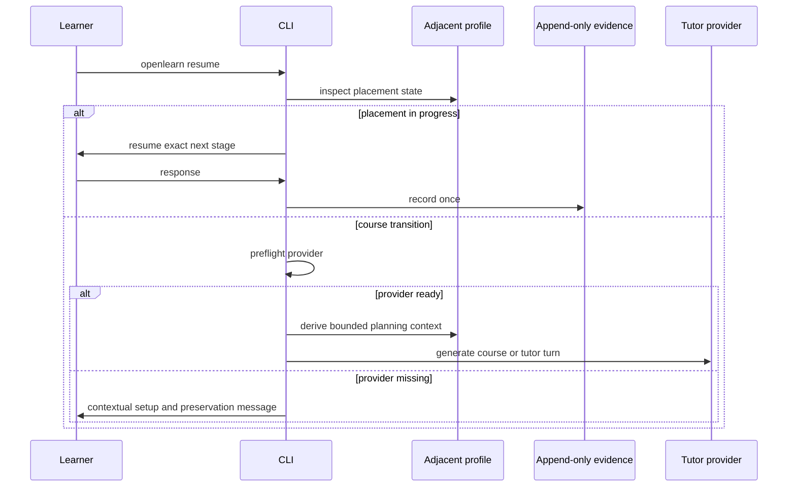

# Interview Learner Journey Recovery - Plan

## Goal Capsule

- Restore one coherent learner journey from `new --interview-prep` through profile setup, placement, course planning, and the first lesson.
- Preserve local-first profile storage, append-only placement evidence, idempotent recovery, and the rule that placement never grants mastery.
- Treat the supplied Fish-terminal transcript as the primary regression scenario.
- Stop only when focused tests, PTY workflow coverage, independent review, `make check`, and a replay of the supplied inputs are green.
- Keep OCI runner behavior, interview catalog content, mastery policy, and provider selection outside this fix.

---

## Product Contract

### Summary

Interview-prep creation should guide a learner through the minimum useful profile, allow an offline bounded placement that behaves like an interview, recover through the generic resume surface, and carry the provisional result into course planning without asking for a second placement.
Model-backed teaching must advertise provider readiness before presenting misleading session output, while model-free profile and placement work must remain available.

### Problem Frame

The current command surfaces return plausible isolated outputs but fail as one learner journey.
Profile creation silently stores defaults, clarification questions receive no response, implementation is collected through one-line input, blank input terminates placement with an internal validation message, and generic resume enters a separate tutor state machine.
Completed interview placement is not included in course-outline context, and course start may offer a second legacy placement quiz.
The missing provider key is therefore discovered only after the learner has spent several minutes in a flow that appears to have been forgotten.

### Requirements

**Guided setup and readiness**

- R1. Interactive `new --interview-prep` guides the learner through a concise editable profile with visible defaults, while non-interactive creation remains deterministic and does not block for input.
- R2. Interview-prep creation distinguishes offline placement capability from model-backed teaching and reports missing provider configuration without blocking topic or profile creation.
- R3. Ordinary topic creation remains free of interview prompts, profile reads, and interview state.

**Interview-quality placement**

- R4. A learner clarification receives a deterministic problem-authoritative interviewer response before the planning stage begins.
- R5. The implementation stage accepts a real multiline solution through an explicit terminal or configured-editor flow on supported platforms.
- R6. Empty input at any placement stage remains on that stage, records no evidence, and offers stage-appropriate choices without exposing storage or contract terminology.
- R7. `/stop`, `/skip`, `/baseline`, `/discard`, EOF, and interruption preserve their documented state transitions and append-only evidence guarantees.

**Continuity and course transition**

- R8. Generic `openlearn resume` routes an in-progress interview placement to its exact next stage before source refresh, provider access, or tutor output.
- R9. Resume routing and provider errors describe adjacent interview profile and placement state, and never say that no previous work exists when placement evidence is present.
- R10. Provisional placement gaps, uncertainty, target, and bounded recommendations inform course planning without copying raw learner responses or granting mastery.
- R11. Interview-prep topics with deferred or completed placement in provisional status enter course planning without being asked to take the legacy optional placement quiz.
- R12. Missing provider configuration is reported before model-backed course output or mutation, with confirmation that saved profile, placement, and course state remain intact.

### Key Flows

- F1. First-time interview course
  - **Trigger:** A learner creates an algorithms topic with `--interview-prep`.
  - **Steps:** The CLI collects or confirms profile inputs, creates the local topic and adjacent profile, reports provider readiness, and offers placement or deferral.
  - **Outcome:** The learner understands what works offline and what requires a provider.
- F2. Bounded placement
  - **Trigger:** The learner starts or resumes placement.
  - **Steps:** The CLI collects seven evidence stages, answers clarification deterministically, accepts multiline implementation, and records each substantive learner response once.
  - **Outcome:** Placement ends provisional or remains resumable without granting mastery.
- F3. Recovery
  - **Trigger:** The learner submits blank implementation input, interrupts placement, or runs generic resume later.
  - **Steps:** Blank input reprompts without a write, interruption preserves state, and generic resume returns to the exact stage.
  - **Outcome:** No evidence is duplicated and no internal validation error reaches the learner.
- F4. Course transition
  - **Trigger:** The learner resumes after deferring or completing bounded placement.
  - **Steps:** Provider readiness is checked, bounded placement context informs the outline, the legacy placement quiz is skipped, and teaching begins.
  - **Outcome:** The learner sees one continuous interview-prep product rather than separate administrative and teaching tools.

### Acceptance Examples

- AE1. Given a TTY interview-prep creation, when the learner accepts defaults or enters role, level, language, schedule, and experience values, then revision 1 contains those canonical values and no follow-up administration command is required.
- AE2. Given the supplied clarification questions about input and return value, when clarification is submitted, then the CLI states that `text` is a Python string, the result is a zero-based start index, and `-1` means no qualifying window before prompting for a plan.
- AE3. Given three saved placement stages, when the learner presses Enter at `implementation>`, then the CLI remains at implementation with three evidence references and prints paste, editor, skip, and stop guidance.
- AE4. Given that same in-progress placement, when the learner runs `openlearn resume`, then placement resumes at implementation without a provider call.
- AE5. Given a provisional placement and no teaching session, when resume context is printed, then placement continuity is shown and `No previous session yet` is absent.
- AE6. Given a completed or deferred bounded placement, when the course is started, then its planning prompt contains bounded profile and placement context and does not ask for the legacy placement quiz.
- AE7. Given a remote provider without an API key, when the learner attempts model-backed teaching, then the CLI fails before tutor output with contextual setup guidance and preserves all learner state.
- AE8. Given an ordinary topic, when it is created and resumed, then existing non-interview behavior remains unchanged.

### Scope Boundaries

#### In scope

- Interactive profile setup and summary.
- Deterministic clarification response for the fixed placement problem.
- Multiline or editor-backed placement implementation capture.
- Empty-input reprompting and actionable recovery copy.
- Generic resume routing and interview-aware continuity.
- Bounded placement context in course planning.
- Removal of the duplicate legacy placement offer for interview-prep topics.
- Early provider-readiness messages and regression documentation.

#### Deferred to Follow-Up Work

- Generalizing deterministic interviewer responses to a future catalog of placement problems.
- Replacing all CLI input with a new terminal UI framework.
- Capturing this fix as a durable `docs/solutions/` learning after behavior is proven.

#### Outside this product change

- Installing Docker or Podman, pulling OCI images, or changing runner isolation.
- Changing catalog rights policy, problem licensing, skill-readiness thresholds, or mastery gates.
- Adding a network dependency or requiring a model for bounded placement.

---

## Planning Contract

### Key Technical Decisions

- KTD1. Keep bounded placement model-free and render clarification from the fixed problem contract rather than calling a tutor model.
  This preserves offline operation and avoids making provider configuration a prerequisite for assessment.
- KTD2. Collect implementation through an explicit multiline/editor interaction while retaining canonical validation at the activity boundary.
  Blank or empty content is a CLI recovery state, not a weakened storage contract.
- KTD3. Route generic resume by durable learner state before entering model-backed tutor behavior.
  The adjacent interview profile remains the source of truth for placement status and next stage.
- KTD4. Build a bounded, derived planning summary from profile and provisional placement outputs.
  Raw calibration answers, code, and reasoning remain in append-only evidence and are not copied into topic metadata or prompts.
- KTD5. Guide learners inside the normal interview-prep creation and resume journey instead of requiring profile and placement administration commands.
  (session-settled: user-directed — chosen over command-by-command testing: users should experience the program as a learner rather than discover internal command surfaces.)
- KTD6. Provider readiness is a capability notice during model-free setup and a fail-fast gate only at the transition into model-backed teaching.
  Keyless local endpoints and mock mode continue to count as configured.

### Learner Interaction Contracts

Profile setup uses this stable order and shows each default in the prompt.
The final summary asks `Create this interview-prep course? [Y/n]`; declining offers edit or cancel, and cancellation before confirmation publishes no topic, profile, or event.

| Prompt | Default or blank behavior |
|---|---|
| Target role family | `general SWE` |
| Target level | `unspecified` |
| Interview date | Not provided |
| Coding language | `python` |
| Data structures experience | `unknown` |
| Algorithms experience | `unknown` |
| Interview experience | `unknown` |
| Weekly practice minutes | `120` |
| Session minutes | `45` |
| Target notes | Not provided |
| Accessibility preferences | Not provided and stored without claiming an accommodation was applied |

After atomic topic and profile creation, the CLI asks `Start offline placement now? [Y/n/d/q]`.
`y` starts placement, `n` or `q` leaves it not started, and `d` records deferral.
EOF or interruption before creation leaves nothing; after creation it preserves the course and prints `openlearn resume`.

The implementation prompt says: `Enter code below; finish with a line containing only /done. Use /editor first to open your configured editor, or /skip, /baseline, /stop.`
Terminal collection preserves indentation and newlines on POSIX, Windows, paste, and injected input without timing heuristics.
`/editor` is recognized only as the first nonblank line.
The editor path uses a private temporary Python file, accepts only nonblank content after a successful editor exit, removes instructional comments before evidence recording, and returns to the same stage on cancellation, launch failure, nonzero exit, or empty content.
A standalone `/done` is reserved as the terminal sentinel.

Blank input on text stages prints `Enter a response, /skip, /baseline, or /stop.` and reprompts.
Blank implementation input prints the multiline and editor instructions and reprompts.
Stop, EOF, and interruption copy leads with `Placement saved at <stage> (<evidence>/7). Run openlearn resume to continue.` and presents the explicit placement command only as a secondary troubleshooting path.

Generic resume follows this routing table after synchronizing adjacent state and before provider or source work.

| Interview profile | Placement | Course started | Route |
|---|---|---|---|
| absent | n/a | false | Existing ordinary course-start behavior |
| absent | n/a | true | Existing tutor resume |
| present | `not_started` | false | Offer start offline placement, defer and continue, or exit |
| present | `in_progress` | false | Resume exact placement stage offline |
| present | `deferred` or `provisional` | false | Show bounded interview continuity, preflight provider, then plan the course |
| present | `stale` | false | Explain that profile changes invalidated recommendations, then offer a new offline placement, explicit deferral with profile-only planning, or exit |
| present | any consistent state | true | Show normal teaching continuity and resume tutor behavior |

When provider setup is missing, the CLI prints a compact deterministic context naming the topic, placement status, and evidence count, confirms that work is saved, and gives configuration plus resume commands.
It does not print the full model-backed `Where you left off` block, refresh sources, call a provider, or mutate course state.
Dry-run mode bypasses missing-key rejection because it makes no provider call, and it must not mutate profile, activity, topic, or session state.

### High-Level Technical Design

### Assumptions

- Interactive onboarding is enabled only when the command has a real learner-facing input channel; scripted and test invocations keep deterministic defaults unless they inject input explicitly.
- The placement problem defines nonpositive width and width larger than the text as returning `-1`, and treats the input as a Python string with zero-based indexing.
- Terminal multiline collection is the default code-entry surface, with `/editor` as an explicit first-line choice.
- No external research is required because the current repository contains the owning state machines, editor patterns, provider helpers, and reproduced failure.
- No institutional learning corpus exists under `docs/solutions/`, so current code and regression evidence are authoritative.

### System-Wide Impact

- The CLI command dispatcher must carry injectable input through `new` and `resume` without changing ordinary command behavior.
- Course-outline prompt construction gains bounded adjacent interview context but must preserve prompt-size and privacy boundaries.
- Provider preflight must continue honoring environment variables, saved config, keyless localhost endpoints, and mock mode.
- Provider preflight must preserve existing dry-run prompt rendering without requiring a key or mutating state.
- Placement activity journals and append-only event publication remain unchanged except for avoiding writes on blank input.

### Risks and Mitigations

- TTY-gated onboarding can accidentally hang scripts.
  Keep non-interactive behavior deterministic and cover both paths.
- Multiline paste differs across POSIX, Windows, and injected test input.
  Provide an explicit termination protocol and editor fallback rather than relying only on timing heuristics.
- Generic resume can route inconsistent profile and activity state incorrectly.
  Reuse existing synchronization and fail-closed recovery before choosing a destination.
- Adding placement context can leak raw evidence into provider prompts.
  Derive only normalized gap, uncertainty, target, and schedule fields and test for excluded raw responses.
- Skipping the legacy quiz could affect normal courses.
  Gate the skip on the adjacent interview-prep profile and retain existing behavior elsewhere.

---

## Implementation Units

### U1. Guide profile setup and readiness

- **Goal:** Make interview-prep creation a learner-facing setup flow with early capability guidance.
- **Requirements:** R1, R2, R3; F1; AE1, AE8.
- **Dependencies:** None.
- **Files:** `src/openlearn/cli.py`, `tests/test_cli.py`, `README.md`.
- **Approach:** Add a reusable profile collector around canonical defaults and validation, invoke it only for interactive interview-prep creation, atomically publish after confirmation, offer placement or deferral immediately afterward, and surface provider readiness without blocking model-free work.
- **Execution note:** Start with failing CLI tests for interactive, invalid-input, abort, and non-interactive behavior.
- **Patterns to follow:** `cmd_init`, `menu_new_course`, `default_interview_profile_values`, `provider_is_configured`.
- **Test scenarios:**
  - TTY or injected onboarding stores entered role, level, language, schedule, and experience values in revision 1.
  - Empty answers visibly accept defaults and optional empty values render as not provided.
  - Invalid numeric or date input reprompts without publishing a partial topic.
  - EOF or interruption before confirmation leaves no topic or interview profile.
  - EOF or interruption after creation preserves the course and prints generic resume guidance.
  - The post-create choice starts placement, records deferral, or leaves placement not started without requiring an administration command.
  - Non-interactive creation uses canonical defaults without reading stdin.
  - Missing provider prints the offline-placement versus teaching distinction but still creates the topic.
  - Ordinary topic creation remains unchanged.
- **Verification:** Focused CLI tests prove setup behavior and provider configuration precedence without reading real config or learner data.

### U2. Repair the placement interview loop

- **Goal:** Make clarification and implementation stages usable while preserving durable evidence semantics.
- **Requirements:** R4, R5, R6, R7; F2, F3; AE2, AE3.
- **Dependencies:** None.
- **Files:** `src/openlearn/cli.py`, `src/openlearn/interview_prep.py`, `tests/test_cli.py`, `tests/test_interview_prep.py`, `manual-tests/interview-placement.md`.
- **Approach:** Add a fixed full assumption card for deterministic interviewer replies, centralize all-stage blank recovery, and provide sentinel-terminated multiline collection plus explicit editor entry before calling the unchanged evidence contract.
- **Execution note:** Reproduce the supplied blank-input failure first and retain the red result in the implementation handoff.
- **Patterns to follow:** `read_repl_message`, sentinel paste collection in context menus, `configured_editor_argv`, `open_drill_in_editor`, placement activity synchronization.
- **Test scenarios:**
  - The supplied clarification question prints the problem-authoritative answer before the plan prompt and records only the learner question.
  - Every substantive clarification receives the same complete assumption card, and recovery may safely redisplay it without duplicating learner evidence.
  - Multiline Python is joined exactly once, remains within the existing size bound, and advances only the implementation stage.
  - Blank implementation input reprompts indefinitely without event, evidence reference, or process exit.
  - Blank calibration, clarification, plan, tests, complexity, and follow-up input also reprompts without a write or internal validation message.
  - Empty editor content and editor launch failure keep the same stage and offer terminal fallback.
  - `/stop`, `/skip`, `/baseline`, `/discard`, EOF, and Ctrl-C preserve their existing state transitions.
  - Resume copy reports evidence progress, the exact next stage, and both generic and explicit recovery commands.
  - Oversized or malformed durable evidence still fails at the canonical validation boundary.
- **Verification:** Focused placement and activity tests pass across happy, blank, interruption, and replay paths.

### U3. Unify resume and course transition

- **Goal:** Route resume by durable state and make bounded placement shape the course exactly once.
- **Requirements:** R8, R9, R10, R11, R12; F3, F4; AE4, AE5, AE6, AE7, AE8.
- **Dependencies:** U1, U2.
- **Files:** `src/openlearn/cli.py`, `tests/test_cli.py`, `tests/workflows/test_repl_smoke.py`, `README.md`, `docs/ARCHITECTURE.md`.
- **Approach:** Inspect synchronized adjacent interview state before tutor work, apply the complete resume routing table, derive privacy-bounded planning context for deferred or provisional placement, skip the legacy placement quiz for interview-prep topics, and preflight provider readiness before source refresh, model output, or mutation.
- **Execution note:** Begin with integration tests that prove generic resume does not call the provider for active placement and that course planning consumes only bounded derived context.
- **Patterns to follow:** `sync_interview_placement`, `resume_context_prompt`, `print_resume_context`, `placement_context_prompt`, `course_outline_prompt`, `provider_is_configured`.
- **Test scenarios:**
  - Generic resume with three saved stages enters implementation without refreshing sources or calling a provider.
  - Generic resume on an ordinary started topic retains current tutor behavior.
  - Deferred and provisional placement states appear in continuity output and suppress the no-previous-session fallback.
  - Not-started interview placement offers offline placement, deferral into course planning, or exit.
  - Stale placement explains invalidated recommendations and requires an explicit new-placement or profile-only deferral choice before teaching.
  - Course planning receives target, gaps, uncertainty, and schedule but excludes raw calibration, code, and reasoning.
  - Interview-prep course start does not offer the legacy placement quiz.
  - Missing remote API key prints compact interview-aware continuity, then fails before full resume context, source refresh, provider calls, or course mutation.
  - Mock mode and keyless local endpoints pass preflight.
  - Dry-run mode renders the appropriate planning or resume prompt without a key and without mutation.
  - Inconsistent activity/profile state fails closed through existing synchronization.
- **Verification:** Focused unit and workflow tests prove the complete state routing and prompt privacy contract.

### U4. Prove the learner journey

- **Goal:** Lock the transcript into durable regression coverage and document the normal learner path.
- **Requirements:** R1-R12; F1-F4; AE1-AE8.
- **Dependencies:** U1, U2, U3.
- **Files:** `tests/workflows/test_interview_journey.py`, `manual-tests/interview-placement.md`, `README.md`.
- **Approach:** Drive the public CLI through an isolated PTY from interactive creation and its placement handoff, use the supplied calibration, clarification, and plan inputs, submit an initial blank implementation, complete a fixed multiline solution and remaining stages, exercise missing-provider recovery, enable mock mode, accept the outline, and render the first lesson.
- **Execution note:** Treat the PTY transcript as the final behavioral proof rather than reconstructing success from internal state alone.
- **Patterns to follow:** `tests/workflows/test_repl_smoke.py`, temporary `OPENLEARN_HOME`, mocked provider smoke flows.
- **Test scenarios:**
  - Exact supplied inputs receive a clarification answer, survive blank implementation, and accept multiline code.
  - Interrupted placement resumes through generic resume at the same stage with no duplicated evidence.
  - Missing provider guidance appears before teaching and preserves placement.
  - After mock or configured-provider setup, generic resume starts course planning without a second placement quiz.
  - The mocked journey accepts the generated outline and renders the first tutor lesson marker.
  - Final profile is provisional with seven evidence references and no mastery update.
- **Verification:** The isolated PTY scenario and manual replay both complete without private configuration, learner data, or live provider calls.

---

## Verification Contract

| Gate | Applies to | Done signal |
|---|---|---|
| Focused CLI and placement tests | U1-U3 | New and existing interview lifecycle tests pass with isolated homes and config. |
| PTY learner journey | U4 | The supplied transcript completes through an observable mocked first lesson with expected recovery output. |
| `make check` | U1-U4 | Ruff, unittest, pytest, and mocked smoke are green. |
| Independent `ce-code-review` | U1-U4 | No unresolved P0-P2 correctness, reliability, privacy, or standards findings remain. |
| Manual replay | U1-U4 | Fish-terminal learner flow is coherent from creation through the first course session. |

Slow provider-backed tutor and outcome evaluations are not required because the fix changes deterministic orchestration and error handling rather than tutor-output policy.

---

## Definition of Done

- All R1-R12 behavior is implemented without weakening placement validation or mastery policy.
- Interactive and non-interactive creation paths are both covered.
- Empty and interrupted implementation entry never loses or duplicates placement evidence.
- Generic resume selects the correct placement or teaching state before provider work.
- Course planning uses bounded derived interview context and never asks interview-prep learners for the legacy duplicate placement.
- Missing provider configuration is early, contextual, and non-destructive.
- Ordinary topics and keyless local providers retain existing behavior.
- Focused tests, PTY regression, `make check`, independent review, and the supplied-input manual replay are green.
- Abandoned experiments and temporary test artifacts are absent from the final diff.
- The branch is merged only into local `main`, with no push.
