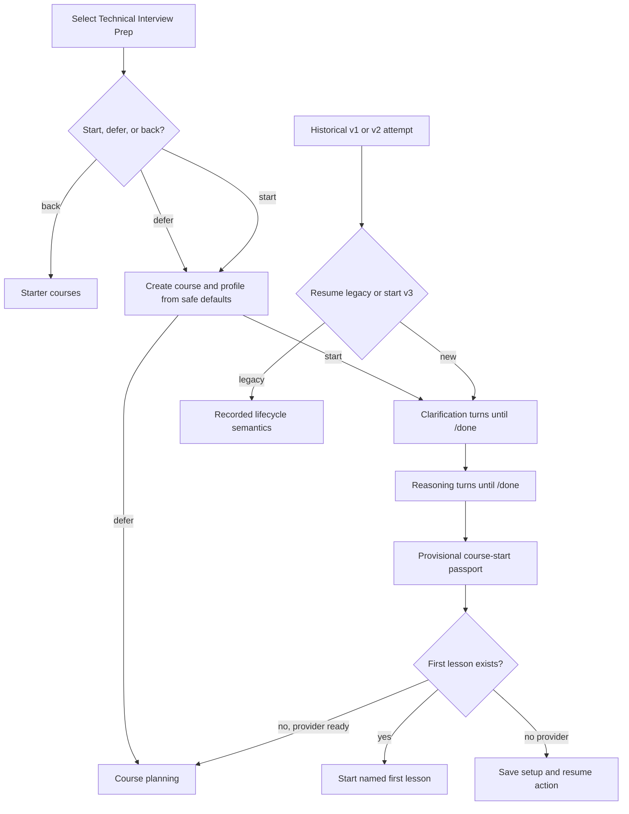

# CLI Reasoning Placement - Plan

## Goal Capsule

- **Objective:** Replace executable onboarding placement with a short CLI interview conversation that selects a safe starting route, and expose technical interview preparation as a premade course.
- **Product authority:** The CLI remains the reference product surface, while actual coding evidence is collected later during normal course practice.
- **Open blockers:** None.

---

## Product Contract

### Summary

Initial technical-interview placement will be a short, model-optional CLI reasoning assessment that recommends where to begin without executing learner code or claiming to measure coding fluency.
The premade course menu will include a clearly named technical interview preparation course that enters this streamlined journey.

### Problem Frame

The current placement asks a long sequence of profile and assessment questions, launches the learner's ordinary editor, and requires Docker or Podman to validate code.
That makes first-run setup fragile, allows normal editor assistance to invalidate the signal, and can trap learners in an implementation retry loop before they reach the course.
The useful onboarding decision is narrower: choose a safe first lesson while preserving uncertainty that later practice can resolve.

### Key Decisions

- **Placement selects a starting route, not coding proficiency.** (session-settled: user-approved — chosen over executable onboarding assessment: it maximizes compatibility and moves trustworthy coding evidence into normal practice.) Governs R1, R5, R7.
- **Keep interview communication in placement.** (session-settled: user-approved — chosen over removing technical assessment entirely: clarifying, planning, edge-case, testing, and complexity reasoning remain useful routing evidence.) Governs R2, R3, R4.
- **Keep the CLI as the release surface.** (session-settled: user-directed — chosen over beginning a web application now: the terminal journey should be polished before another interface consumes it.) Governs R8.

### Requirements

**Placement purpose and evidence**

- R1. Initial placement must recommend a provisional starting route without requiring an editor, language runtime, Docker, Podman, code execution, or model provider.
- R2. Placement must use one original interview-style problem and support natural clarification before requesting an approach.
- R3. Placement must collect the learner's approach, chosen data structures, important edge cases, expected tests, and time and space complexity through a compact CLI conversation.
- R4. Dictated, pasted, or multi-turn answers must remain attached to the intended conversation step until the learner explicitly advances.
- R5. Placement must leave coding fluency unobserved and must not grant mastery, readiness, or unaided implementation credit.
- R6. The result must show a recommended first activity, evidence-backed reasoning signals, one practice priority, one uncertainty to verify, and a direct action to begin learning.
- R7. The passport must name the coding-fluency uncertainty and the normal course activity that should verify it later.

**Course discovery and entry**

- R8. The premade course menu must include a technical interview preparation course with a clear LeetCode-style algorithms and data-structures description.
- R9. Choosing that premade course must create the interview-prep profile and offer the compact reasoning placement without routing through generic course setup questions that already have safe defaults.
- R10. Interview courses must expose target, schedule, accessibility, and interview-format settings after creation without blocking the default course entry.

**Recovery and compatibility**

- R11. Stop, resume, EOF, and interruption must preserve durable state and return the learner to the exact useful conversation action; skip and discard must apply explicit durable termination semantics without erasing append-only evidence.
- R12. Existing versioned placement records must remain readable, and an unfinished executable placement must have an explicit safe route into the new conversation or preserved legacy completion behavior.
- R13. Non-interview courses and ordinary starter-course behavior must remain unchanged.

### Key Flows

- F1. Premade technical interview course
  - **Trigger:** A learner opens Starter courses and selects Technical Interview Prep.
  - **Steps:** OpenLearn explains that placement is short and non-coding and offers start, defer, or back before writing course files; start and defer create the course from safe defaults, while back returns without creating it.
  - **Outcome:** The learner reaches useful assessment or course work without configuring an editor or secure runtime.
  - **Covers:** R1, R8, R9, R10.
- F2. Compact reasoning placement
  - **Trigger:** A learner starts or resumes initial placement.
  - **Steps:** OpenLearn presents one problem, conducts bounded clarification, and collects one structured route explanation with a visible, non-punitive five-minute guideline.
  - **Outcome:** OpenLearn produces a provisional course-start passport while coding fluency remains unknown.
  - **Covers:** R2, R3, R4, R5, R6.
- F3. Interrupted placement
  - **Trigger:** The learner stops, exits, or is interrupted during conversation.
  - **Steps:** OpenLearn saves completed turns and the current action, then resumes without replaying completed setup or losing text.
  - **Outcome:** The learner continues productively with no duplicate evidence.
  - **Covers:** R11, R12.

### Acceptance Examples

- AE1. **Covers R1, R8, R9.** Given a fresh local installation with no Docker, Podman, editor configuration, or provider, when the learner selects Technical Interview Prep, then they can complete or defer placement and enter the course without a dependency error.
- AE2. **Covers R3, R4.** Given a learner dictates an approach across several lines, when they have not explicitly advanced, then all lines remain part of the same response rather than becoming answers to later stages.
- AE3. **Covers R5, R6.** Given a strong reasoning walkthrough with no executed code, when placement completes, then reasoning can influence the first activity while coding fluency remains unknown and no mastery is granted.
- AE4. **Covers R6.** Given placement completes or is conservatively shortened, when the result appears, then the default action starts the named first lesson instead of printing internal rubric identifiers or returning to an unexplained prompt.
- AE5. **Covers R7.** Given placement has no coding evidence, when the passport is created, then it names the later course activity that will verify coding fluency without rerunning placement.
- AE6. **Covers R11, R12.** Given an interrupted historical or current placement, when the learner resumes, then OpenLearn returns to a valid next action without reopening an editor or repeating an unchanged infrastructure failure.
- AE7. **Covers R13.** Given a learner selects a non-interview starter course, when it is created and started, then no interview profile or placement dialogue appears.

### Scope Boundaries

- Executable coding assessment is removed from initial placement, not from the product.
- Real coding activities, secure execution, controlled Neovim, and timed mock interviews remain later course capabilities.
- Continuous recalibration from later coding evidence remains follow-up work; this change records the verification target it will consume.
- Building or designing the web application is deferred until the complete CLI journey is release-ready.
- Placement will not claim psychometric accuracy or hiring readiness from one conversation.

### Dependencies and Assumptions

- Existing append-only interview evidence and versioned lifecycle compatibility remain authoritative.
- Reasoning evidence may route learning but cannot substitute for validated production, transfer, or delayed-retrieval evidence.
- The technical interview premade course can reuse the existing algorithms and data-structures curriculum while adding interview-specific entry behavior.

### Sources

- `docs/plans/2026-07-28-002-fix-interview-learner-journey-plan.md`
- `docs/TUTOR_INTERACTION.md`
- `docs/DEPENDENCIES.md`

---

## Planning Contract

Product Contract unchanged.

### Key Technical Decisions

- KTD1. **Add a new reasoning-placement lifecycle.** Introduce a v3 lifecycle with `clarification` and `reasoning` stages instead of changing the persisted executable meaning of v1 or v2. Governs R1, R2, R3, R5, R12.
- KTD2. **Persist unfinished stage drafts in the versioned placement projection.** A v3-only draft saves accepted lines after each turn. Publishing uses a deterministic attempt-and-stage evidence ID; synchronization atomically records the referenced evidence and clears only its matching draft, including recovery after an activity append but before projection. Governs R4, R11, R12.
- KTD3. **Keep placement on the existing interview activity seam without creating a coding attempt.** V3 uses a non-executable interview problem activity and bypasses editor, runner, workspace, and coding-attempt reconciliation. Governs R1, R5, R13.
- KTD4. **Make the course template declare its entry behavior.** Extend bundled template metadata with an optional validated interview-prep entry mode so discovery and creation do not depend on a filename special case. Governs R8, R9, R13.
- KTD5. **Converge every interview-course entry on one creation helper.** Starter Courses, the interview shortcut, onboarding, and explicit template creation share safe defaults and the same placement offer. Governs R8, R9, R10.

### High-Level Technical Design

### Sequencing

1. Add v3 state, draft, evidence, and result contracts while keeping v1 and v2 fixtures green.
2. Add the v3 CLI controller and historical-attempt routing over those contracts.
3. Add template entry metadata and converge course creation paths on the controller.
4. Replace the public journey replay and documentation, then run the full repository gates.

### Risks and Mitigations

- Exact-key profile validation can reject every stored profile if v3-only fields leak into legacy records.
  Keep version-aware key and result validation with unchanged v1 and v2 fixtures.
- Publishing activity evidence and clearing a draft cross two durable stores.
  Use deterministic evidence IDs, matching-draft reconciliation, and replay tests for interruption before activity append, after activity append, and after profile projection.
- A reasoning-only result can accidentally imply coding readiness through existing starting-level copy.
  Give v3 a version-aware passport and assert that coding fluency is always uncertain.
- A new template can silently create an ordinary course when invoked outside the menu.
  Put entry mode in validated template metadata and honor it from every creation path.

---

## Implementation Units

### U1. Add the conversation-only placement contract

- **Goal:** Add versioned v3 lifecycle, draft, scoring, and passport behavior without changing v1 or v2 records.
- **Requirements:** R1-R7, R11, R12; F2, F3; AE2, AE3, AE5, AE6.
- **Dependencies:** None.
- **Files:** `src/openlearn/interview_prep.py`, `tests/test_interview_prep.py`.
- **Approach:**
  1. Define a v3 lifecycle containing clarification and reasoning stages and make it the default for newly created or reset placement state where no historical attempt is active.
  2. Extend placement validation with a v3-only draft that stores the current stage, bounded lines, and update timestamp while legacy exact-key formats remain accepted.
  3. Add idempotent draft append, load, and clear operations that never advance the lifecycle by themselves.
  4. Score clarification and reasoning signals conservatively and leave coding fluency uncertain through an empty evidence axis.
  5. Produce and validate the v3 course-start passport without raw learner text or mastery claims.
- **Execution note:** Start with compatibility and interruption tests before changing lifecycle defaults.
- **Patterns to follow:** `_placement_versions()`, `_empty_placement_for_reset()`, `record_placement_evidence()`, version-aware rubric projection, atomic profile writes.
- **Test scenarios:**
  1. New v3 placement starts at clarification and records its lifecycle and rubric versions.
  2. Each accepted draft line survives reload without creating scored evidence or advancing the stage.
  3. Publishing a joined stage response clears the matching draft and is idempotent across replay.
  4. Empty, oversized, malformed, cross-stage, and non-v3 drafts fail closed.
  5. A complete strong reasoning sample leaves coding fluency uncertain and grants no mastery.
  6. Weak, skipped, stopped, discarded, and stale v3 paths remain provisional and bounded; baseline remains a legacy-only command.
  7. Existing legacy v1, explicit v1, and executable v2 fixtures load and retain their original stages, rubric results, and reset behavior.
- **Verification:** Focused interview-profile tests prove v3 behavior and unchanged historical semantics.

### U2. Replace new-placement UI with a durable CLI conversation

- **Goal:** Deliver the short clarification and reasoning flow, recovery behavior, and course-start passport without touching an editor or runner.
- **Requirements:** R1-R7, R11-R13; F2, F3; AE1-AE6.
- **Dependencies:** U1.
- **Files:** `src/openlearn/cli.py`, `src/openlearn/coding_activities.py`, `tests/test_cli.py`, `tests/test_activities.py`.
- **Approach:**
  1. Make new placement start v3 and route by the attempt's recorded lifecycle before rendering any prompt.
  2. Show a concise five-minute guideline, then accept repeated clarification or reasoning lines until `/done`, persist each line before responding, and restore the draft on resume.
  3. Answer supported clarification questions from the deterministic problem contract without advancing the stage; unknown, repeated, multi-question, blank, and non-question input stays in clarification with deterministic fallback guidance.
  4. On `/done`, publish one joined observation through the existing activity evidence contract and synchronize it idempotently.
  5. Present reasoning as one composable response with a visible checklist for approach, data structures, edge cases and tests, and time and space complexity. `/show` reviews the saved draft and `/undo` removes its latest line before publication.
  6. Apply explicit command semantics: `/done` publishes the non-empty current draft and advances; `/stop`, EOF, and interruption preserve it and exit; `/skip` publishes uncertainty for the current stage and advances; `/baseline` is legacy-only; `/discard` confirms, clears the active v3 projection, preserves published evidence, and exits.
  7. Render text-only progress and status cues, keep every action keyboard-operable, avoid color-dependent meaning, preserve prompt order for screen readers and dictation, and test narrow terminals plus EOF.
  8. Render the v3 passport and apply one continuation rule: start the named first lesson if it exists; otherwise, when a provider is ready, plan the course and start the resulting first lesson; without a provider, persist that exact next action and show setup plus resume guidance.
  9. For in-progress v1 or v2 attempts, show plain-language choices that recommend the new short placement, explain that published work is preserved, confirm before abandoning the active legacy activity, and allow continue-old-placement or defer.
- **Patterns to follow:** `read_repl_message()`, `placement_clarification_response()`, topic activity journals, `sync_interview_placement()`, version-routed lifecycle helpers.
- **Test scenarios:**
  1. Covers AE1. A v3 placement completes with editor, runner, attempt store, provider, Docker, and Podman calls configured to fail if invoked.
  2. Covers AE2. Several dictated or pasted lines stay on the same stage until `/done`.
  3. A clarification question receives a contract answer and remains at clarification.
  4. `/done` with no draft gives concise guidance and records nothing; `/show` and `/undo` operate only on the saved current-stage draft.
  5. Covers F3 / AE6. Stop, EOF, and interruption resume the exact stage with the saved draft and no duplicate evidence.
  6. Skip and discard terminate or advance v3 with documented uncertainty and append-only history; baseline remains available only while continuing a legacy placement.
  7. A legacy active attempt receives an explicit new-placement choice, while choosing legacy preserves its recorded semantics.
  8. Covers AE4. Completion hides rubric IDs and deterministically starts an existing named first lesson or plans and starts one when a provider is ready.
  9. Without a provider, completion saves the named next action and gives setup plus resume guidance without reporting placement failure.
  10. Covers AE7. Non-interview topics never receive v3 prompts or state.
- **Verification:** CLI and activity-contract tests prove the public text flow, durable boundaries, and absence of coding dependencies.

### U3. Add the premade technical interview course

- **Goal:** Make Technical Interview Prep discoverable in Starter Courses and route every entry path through safe defaults.
- **Requirements:** R8-R10, R13; F1; AE1.
- **Dependencies:** U2.
- **Files:** `src/openlearn/course_templates.py`, `src/openlearn/templates/technical-interview-prep.json`, `src/openlearn/interview_skills.py`, `src/openlearn/onboarding.py`, `src/openlearn/cli.py`, `tests/test_course_templates.py`, `tests/test_interview_skills.py`, `tests/test_onboarding.py`, `tests/test_cli.py`.
- **Approach:**
  1. Add an optional validated template entry mode while accepting every existing five-field template unchanged.
  2. Add the technical interview template with a LeetCode-style goal and interview-focused algorithms and data-structures units.
  3. Create one interview-course entry helper that selects a collision-free name, uses profile defaults, and asks start, defer, or back before persistence; back writes nothing.
  4. Route Starter Courses, the interview shortcut, onboarding, and explicit template creation through that helper.
  5. Let first-run onboarding choose this offline destination before provider setup, defer model configuration until course planning, and persist the exact continuation that setup should resume.
  6. Add an Interview settings action for interview courses while leaving ordinary Course options unchanged.
  7. Keep the algorithms template valid for ordinary courses and historical interview metadata.
- **Patterns to follow:** immutable `CourseTemplate`, `available_course_templates()`, `menu_starter_courses()`, `menu_interview_prep()`, onboarding destinations, interview skill graph seeding.
- **Test scenarios:**
  1. Legacy templates without entry mode load unchanged.
  2. Supported entry mode loads and unknown or malformed values fail validation.
  3. Technical Interview Prep appears in menu and command template listings with stable data-driven selection.
  4. Covers F1 / AE1. Selecting it creates topic and profile from defaults without name, goal, or profile questionnaires.
  5. Placement start and defer create one complete course and profile, while back creates neither.
  6. Explicit `new --template technical-interview-prep` infers interview-prep mode.
  7. The shortcut and onboarding produce the same template, goal, profile, and next action.
  8. Interview settings edit advanced profile values after creation without replaying setup, and placement output honors text-only and non-punitive accessibility behavior.
  9. Covers AE7. Algorithms and every other starter remain ordinary courses.
  10. A bare providerless invocation can select this course, finish or defer placement, and receive a saved provider-setup continuation.
- **Verification:** Template, onboarding, skill-graph, and menu tests prove one consistent entry contract.

### U4. Replay and document the complete CLI journey

- **Goal:** Replace the brittle executable-placement replay with durable coverage and user documentation for the reasoning-first flow.
- **Requirements:** R1-R13; F1-F3; AE1-AE7.
- **Dependencies:** U1-U3.
- **Files:** `tests/workflows/test_interview_journey.py`, `manual-tests/interview-placement.md`, `README.md`, `docs/TOPIC_FORMAT.md`, `docs/TUTOR_INTERACTION.md`, `docs/DEPENDENCIES.md`, `docs/ARCHITECTURE.md`.
- **Approach:**
  1. Rewrite the PTTY journey from premade-course selection through multiline placement, passport, provider boundary, course planning, and first lesson.
  2. Add separate restart coverage from each durable v3 stage and one historical-attempt migration replay.
  3. Remove claims that initial placement requires secure execution while retaining those requirements for later coding checks.
  4. Document the distinction among initial routing placement, normal coding practice, and full mock interviews.
- **Patterns to follow:** isolated OpenLearn homes, deterministic mock provider behavior, public CLI assertions, sanitized dogfood evidence.
- **Test scenarios:**
  1. Covers AE1-AE5. A fresh no-container journey reaches the first lesson through the premade template and reasoning placement.
  2. Covers AE6. Stop and process restart resume from clarification and reasoning drafts.
  3. Historical v1 and v2 transition copy does not lose or reinterpret evidence.
  4. Covers AE7. A representative ordinary starter remains free of interview state and prompts.
  5. No default output exposes raw rubric IDs, stage counts, workspace paths, or false autocomplete claims.
- **Verification:** The focused PTTY workflow, full end-to-end suite, and manual terminal replay all match the documented journey.

---

## Verification Contract

| Gate | Scope | Done signal |
|---|---|---|
| Focused domain tests | `tests/test_interview_prep.py`, `tests/test_activities.py`, `tests/test_course_templates.py`, `tests/test_interview_skills.py` | Versioning, evidence, template, and compatibility scenarios pass. |
| Focused CLI tests | `tests/test_cli.py`, `tests/test_onboarding.py` | Menu, conversation, resume, passport, and entry-path scenarios pass. |
| Public journey | `tests/workflows/test_interview_journey.py` | A no-container technical interview learner reaches the first lesson. |
| Repository gate | `make check` | Formatting, lint, and automated tests pass. |
| Review gate | `make review` | The exact integration head passes the repository review suite. |
| Manual replay | `manual-tests/interview-placement.md` | The visible CLI journey is short, comprehensible, and contains no coding setup during placement. |

---

## Definition of Done

- New technical interview placement completes without editor, runtime, container, code execution, or provider setup.
- Multiline and dictated answers are durable until explicit advancement.
- Coding fluency remains unknown and no placement outcome grants mastery.
- Technical Interview Prep is discoverable and creates the same course through every supported entry path.
- Existing v1 and v2 records remain readable, and active historical attempts receive a safe explicit transition.
- The default result gives one useful next action without internal rubric or storage vocabulary.
- Non-interview behavior remains unchanged.
- Focused tests, the public PTTY journey, `make check`, and `make review` pass.
- Documentation describes current behavior and secure execution only where coding actually occurs.
- Abandoned implementation experiments and generated learner data are absent from the final diff.
