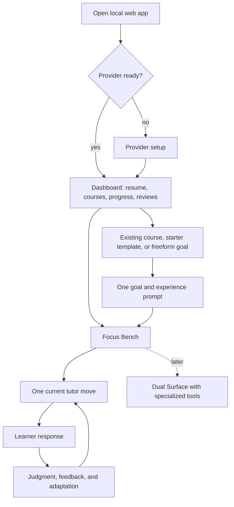
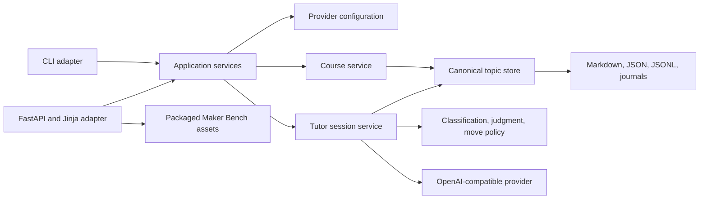

# Local Web Tutor MVP - Plan

## Goal Capsule

- **Objective:** Deliver a local-first web interface that lets a learner configure a provider, create or resume a course, study through a focused tutor loop, and see durable progress without needing the terminal.
- **Product authority:** This plan defines the first web MVP and its relationship to the existing CLI.
- **Open blockers:** None.

---

## Product Contract

### Summary

openlearn will add a local web interface over shared provider, course, storage, and tutor-session services.
The interface will cover setup, course creation, progressive calibration, focused lessons, and progress while Technical Interview Prep remains the reference course rather than a special-case architecture.

### Problem Frame

The CLI now exposes the intended tutor behavior, but technically dense placement and lesson flows remain difficult to scan and respond to for sustained periods.
The learner often stops after interview placement because the accumulated prompts, instructions, and output make starting the actual course feel like another large task.
Terminal rendering improvements cannot fully solve the cognitive load created by a line-oriented interface.

The web MVP must prove that stronger visual hierarchy and controlled information density help a learner study longer while still producing real mastery evidence.
It must not become a generic AI chat interface or trade local ownership for hosted convenience.

### Actors

- A1. **Learner:** Configures model access, creates or resumes courses, responds to tutor moves, reviews progress, and controls navigation.
- A2. **Tutor:** Uses persisted learner evidence to judge understanding, select the next move, and update durable course progress.

### Key Decisions

- **Build a complete but narrow web journey** (session-settled: user-directed - chosen over shipping only one web flow: the MVP must reveal which part of the whole learning experience becomes the next bottleneck). Governs R1-R6.
- **Use progressive calibration** (session-settled: user-directed - chosen over a separate placement or self-selected level: the learner should receive teaching value immediately). Governs R7-R9.
- **Show one current tutor move** (session-settled: user-directed - chosen over a sectioned page or continuous transcript: accumulated content creates the feeling of too much). Governs R10-R13.
- **Use the Maker Bench identity** (session-settled: user-directed - chosen over school-themed palettes: openlearn should fit hobbies, creative work, and professional learning as naturally as student use). Governs R14-R16.
- **Keep the MVP text-only** (session-settled: user-directed - chosen over embedding specialized learning tools immediately: the general tutor loop should prove its value before tools specialize it). Governs R17.
- **Include web provider setup** (session-settled: user-approved - chosen over requiring `openlearn init`: the browser experience should stand on its own). Governs R3.
- **Preserve the CLI as a peer interface** (session-settled: user-directed - chosen over replacing the terminal workflow: keyboard-first users should keep its speed and composability). Governs R2.

### Requirements

**Local application and onboarding**

- R1. The web MVP must run locally, require no openlearn account, and keep learner-owned course and progress data on the learner's machine.
- R2. The web interface and CLI must operate on the same canonical learner data so a course changed in either interface remains consistent in the other.
- R3. The web interface must provide provider selection, API-key entry, model selection, connection validation, clear error recovery, and secure local saving without displaying a stored key.
  A network-unreachable configuration may be saved only through an explicit advanced action, remains marked unverified, and cannot start model-backed teaching until validation succeeds.

**Dashboard and course creation**

- R4. The dashboard must make the next useful action obvious by showing the active course, resume point, course progress, and due review work before secondary management actions.
- R5. The learner must be able to open an existing course, create from a starter template, or create from a freeform learning goal.
- R6. Technical Interview Prep must serve as the reference MVP course without introducing behavior that prevents the same journey from supporting another topic.

**Progressive calibration**

- R7. A new course must begin with one brief goal-and-experience prompt and then start teaching without a separate placement gate.
- R8. The tutor must adjust starting difficulty from evidence gathered during the first lessons rather than treating self-report as mastery evidence.
- R9. Existing learner state and unfinished placement evidence must be preserved, while the default web route lets the learner start receiving instruction instead of forcing completion of a legacy placement.

**Focused tutor session**

- R10. Focus Bench must display one current learning move as the primary content and keep earlier session steps collapsed but accessible.
- R11. Each tutor turn must classify the learner response, judge understanding when appropriate, update durable learner state, and choose the next move from that state.
- R12. The tutor must elicit an attempt before giving a full answer when the learner can reasonably try, adapt support after struggle, and require production or transfer evidence before mastery.
- R13. The session must distinguish learner questions, answers, navigation requests, loading, saved input, tutor feedback, and recoverable errors without relying on a growing chat transcript.

**Visual identity and interaction quality**

- R14. The default visual identity must use the Maker Bench light palette: warm canvas, graphite, tool orange, and enamel teal.
- R15. Dark mode must invert the same visual system with graphite surfaces, light canvas text, and brighter versions of the same orange and teal accents.
- R16. The interface must use modular surfaces, strong hierarchy, visible system status, keyboard-friendly controls, and inexpensive visual effects suitable for long sessions.

**MVP capability boundary**

- R17. The MVP must support concept teaching, examples, free-response reasoning, tutor feedback, review, and progress without requiring an embedded editor, media player, or other field-specific tool.

### Workspace Shape

The visual flow complements R3-R17 and does not replace their behavioral requirements.

### Key Flows

- F1. Provider setup
  - **Trigger:** The learner opens the web interface without a usable provider configuration.
  - **Actors:** A1
  - **Steps:** The learner chooses a provider, enters a key when required, selects a model, validates the connection, and saves the working configuration.
    A network failure may instead save an explicitly unverified configuration that routes back to setup before teaching.
  - **Outcome:** The learner reaches the dashboard without using the CLI.
  - **Covers:** R1, R3.
- F2. Resume learning
  - **Trigger:** The learner opens a dashboard with an active or recently used course.
  - **Actors:** A1, A2
  - **Steps:** The dashboard presents the resume point, the learner opens it, and Focus Bench renders the next learning move with prior session history collapsed.
  - **Outcome:** The learner resumes meaningful work with minimal navigation and no repeated placement gate.
  - **Covers:** R4, R9-R13.
- F3. Create a course
  - **Trigger:** The learner chooses to start something new.
  - **Actors:** A1, A2
  - **Steps:** The learner selects an existing starter template or enters a freeform goal, answers one short experience prompt, and enters the first lesson.
  - **Outcome:** Teaching starts before the learner encounters a separate placement workflow.
  - **Covers:** R5-R8.
- F4. Complete a tutor move
  - **Trigger:** Focus Bench presents a question, explanation, example, or retrieval check.
  - **Actors:** A1, A2
  - **Steps:** The learner responds, openlearn persists the input, the tutor judges or classifies it, learner state updates, and the interface replaces the current move with the selected next move.
  - **Outcome:** The learner sees one clear next action and durable progress reflects the evidence produced.
  - **Covers:** R10-R13, R17.
- F5. Recover from interruption
  - **Trigger:** The browser closes, the provider fails, or a response is interrupted after learner input.
  - **Actors:** A1, A2
  - **Steps:** openlearn retains the submitted learner input and current course position, explains the recoverable state, and offers one clear retry or resume action.
  - **Outcome:** The learner continues without re-entering work or corrupting progress.
  - **Covers:** R2, R11, R13.

### Acceptance Examples

- AE1. New interview-prep learner
  - **Covers R5-R8.**
  - **Given:** A learner creates Technical Interview Prep from the starter template.
  - **When:** They describe their goal and recent experience.
  - **Then:** The first concept lesson starts immediately, and later responses adjust difficulty without awarding mastery from the description alone.
- AE2. Returning learner
  - **Covers R4, R9-R10.**
  - **Given:** A learner has an unfinished course and prior placement evidence.
  - **When:** They choose the dashboard resume action.
  - **Then:** They enter the next useful lesson move, while earlier evidence remains preserved and accessible.
- AE3. Learner struggles
  - **Covers R11-R13.**
  - **Given:** The current move asks for an explanation and the learner shows a prerequisite gap.
  - **When:** The tutor judges the response.
  - **Then:** Focus Bench replaces the move with a smaller prompt or worked example and does not mark the concept mastered.
- AE4. Learner asks a question
  - **Covers R11-R13.**
  - **Given:** A pending check is visible.
  - **When:** The learner asks for clarification instead of answering.
  - **Then:** The tutor answers the question without grading it as evidence and returns to an appropriate check later.
- AE5. Provider request fails
  - **Covers R11, R13.**
  - **Given:** The learner submits a response and the provider becomes unavailable.
  - **When:** The request fails.
  - **Then:** The interface shows that the response was saved and provides a clear retry action without duplicating learner evidence.
- AE6. CLI and web continuity
  - **Covers R1-R2.**
  - **Given:** A learner creates or advances a course in the web interface.
  - **When:** They inspect or resume the same course through the CLI.
  - **Then:** The CLI shows the same canonical course state and does not require a separate migration or import.
- AE7. Dark mode
  - **Covers R14-R16.**
  - **Given:** The learner selects dark mode.
  - **When:** Any MVP screen renders.
  - **Then:** The screen uses the inverted Maker Bench palette while preserving hierarchy, contrast, and the meaning of orange and teal accents.

### Success Criteria

- The reference learner can configure a provider, create Technical Interview Prep, begin learning, and return to the next lesson without using the CLI.
- The reference learner continues beyond calibration into multiple meaningful tutor moves instead of stopping after a placement experience.
- Progress changes only when the tutor records appropriate learning evidence, not because the learner spent time on a page or described prior experience.
- A learner can complete the same core journey for a non-interview topic without encountering interview-specific assumptions.
- Focus Bench remains readable during a sustained session because only one current move competes for primary attention.
- The CLI remains a usable peer interface for the same courses and learner state.

### Scope Boundaries

**Deferred for early follow-up**

- Dual Surface as a general host for specialized learning tools.
- An embedded code editor and technical interview coding workspace.
- YouTube and other lesson-video playback.
- File, folder, public GitHub, and other content imports.

**Deferred for later**

- Sheet-music, simulation, diagram, and other domain-specific toolkits.
- Guided Build as a mobile-first interaction pattern.
- A dedicated mobile application.

**Outside this product's identity**

- A hosted-only service that requires an openlearn account to access local courses.
- A generic AI chat transcript presented as a tutoring product.
- School-only branding, grade-centric framing, or visual language that makes hobby and professional learning feel secondary.

<!-- ce-section: work-relationships -->
### How This Work Fits Together

This plan owns the local web MVP and its text-only learning journey.
The broader capability sequence is directional context rather than a committed roadmap.

- **Depends on:** The existing local learner-state, tutor-policy, provider, and course-template behavior remaining authoritative.
- **Enables:** Dual Surface can later host code and video tools without changing the Focus Bench default.
  - **Enables later:** Domain-specific toolkits can specialize the general tutor for technical, musical, visual, and other fields.
- **Can proceed independently of:** A dedicated mobile application.
  - **Shares:** Guided Build may reuse the web MVP's tutor moves and state while presenting them in a mobile-first sequence.

### Dependencies and Assumptions

- The existing local Markdown, JSON, JSONL, locking, and recovery contracts remain the canonical persistence boundary.
- Existing OpenAI-compatible provider support remains the model-access boundary for the MVP.
- The web MVP will have a local application lifecycle that does not expose learner data beyond the learner's machine by default.
- Technical Interview Prep contains enough concept-level material to validate general tutoring before embedded coding is available.

### Outstanding Questions

No product or planning blocker remains for the MVP.
Execution may tune bounded polling intervals, history page size, and visual spacing without changing the contracts below.

### Sources and Research

- `docs/PLAN.md` defines the local-first product promise, learner-owned storage, and existing interface direction.
- `docs/ARCHITECTURE.md` documents file locking, recovery, provider boundaries, and the current concentration of orchestration in the CLI.
- `docs/TUTOR_INTERACTION.md` and `.claude/skills/openlearn-tutor-policy/SKILL.md` define the tutor loop, answer judging, move selection, and mastery gates adopted by R11-R13.
- `docs/plans/2026-08-04-003-feat-cli-reasoning-placement-plan.md` records the prior decision to defer web work until the CLI journey had been polished enough to expose its structural limits.
- `src/openlearn/tui.py` confirms that the current optional TUI is a thin CLI wrapper rather than a reusable application boundary.
- [FastAPI templates](https://fastapi.tiangolo.com/advanced/templates/) and [static files](https://fastapi.tiangolo.com/tutorial/static-files/) support a packaged server-rendered interface without a separate frontend runtime.
- [FastAPI streaming responses](https://fastapi.tiangolo.com/advanced/custom-response/) support future validated streaming, while the MVP keeps the current full-response validation boundary.
- [Uvicorn settings](https://www.uvicorn.org/settings/) document loopback binding and dynamic port selection for the local launcher.
- [OWASP CSRF guidance](https://cheatsheetseries.owasp.org/cheatsheets/Cross-Site_Request_Forgery_Prevention_Cheat_Sheet.html) informs same-origin checks and token protection for state-changing localhost requests.

---

## Planning Contract

### Product Contract Preservation

This implementation plan preserves R1-R17, A1-A2, F1-F5, and AE1-AE7 without changing their meaning.
Planning decisions select implementation mechanisms only.

### Key Technical Decisions

- KTD1. Build interface-neutral application services and keep CLI and HTTP handlers as peer adapters over them.
  - **Governs:** R2, R5, R7-R13.
  - **Rationale:** `src/openlearn/tui.py` shows that delegating a new interface to CLI functions retains terminal formatting, implicit global state, and interactive side effects.
  - **Consequence:** HTTP routes must not invoke argparse handlers, call `input()`, consume Rich output, or parse terminal prose.
- KTD2. Use FastAPI, Uvicorn, Jinja templates, packaged CSS, and small vanilla JavaScript for the web layer (session-settled: user-approved - chosen over a Node-backed SPA: the local package should stay fast to install and require no second runtime).
  - **Governs:** R1, R3-R5, R10, R13-R16.
  - **Rationale:** The stack supports templates, static assets, typed HTTP boundaries, integration tests, and long-running operations within the existing Python package.
  - **Consequence:** Source-controlled browser assets ship in the wheel and require no build step after installation.
- KTD3. Preserve Markdown, JSON, JSONL, journals, lock identities, and atomic replacement as the only learner-data source of truth.
  - **Governs:** R1-R2, R9, R11.
  - **Rationale:** Existing cross-platform locks and recovery journals already protect user-owned data and cross-process access.
  - **Consequence:** Storage extraction uses compatibility wrappers and characterization tests rather than a format migration or database.
- KTD4. Represent provider status, course snapshots, progress, tutor moves, and operation state as typed application DTOs with no presentation logic.
  - **Governs:** R2-R13.
  - **Rationale:** A canonical `TutorMove` must distinguish visible content, learner action, pending checks, feedback, history, and recovery without reparsing Markdown headings.
  - **Consequence:** Terminal and browser renderers may differ while classification, judgment, mastery, and next-move semantics remain shared.
- KTD5. Model course initialization and tutor submission as durable operations with a client submission ID, expected course revision, and one active operation per course.
  - **Governs:** R2, R7-R13.
  - **Rationale:** File atomicity alone does not prevent duplicate evidence or a generated turn from committing over a newer CLI or browser mutation.
  - **Consequence:** A bounded executor runs operations outside the event loop.
    The state file stores one active operation and the most recent 50 replayable results, while append-only events retain consumed submission IDs.
    A duplicate within the replay window returns its result, an older consumed ID returns an expired-id conflict, a stale revision returns a refreshable conflict, and interruption leaves saved input retryable rather than auto-resubmitting it.
- KTD6. Preserve the full-response tutor validation boundary and expose operation status before publishing one validated move atomically.
  - **Governs:** R10-R13.
  - **Rationale:** Current tutor generation withholds malformed responses until repair succeeds, so raw token streaming would expose content the CLI intentionally rejects.
  - **Consequence:** The MVP shows saved, judging, generating, validating, committed, retryable error, and conflict states through a bounded operation-status endpoint.
- KTD7. Store progressive-calibration answers as learner context only and let normal lesson evidence adjust difficulty and mastery.
  - **Governs:** R6-R9, R11-R12.
  - **Rationale:** Self-report can guide initial examples but cannot prove recall, transfer, or production.
  - **Consequence:** Calibration never writes known concepts, passing attempts, mastery events, or interview-readiness evidence.
- KTD8. Bind only to loopback, validate Host and Origin, require a per-launch CSRF token on mutations, and disable cross-origin access.
  - **Governs:** R1, R3.
  - **Rationale:** A localhost server can still receive forged browser requests or DNS-rebinding traffic.
  - **Consequence:** Provider keys never enter HTML, URLs, browser storage, response bodies, or request logs, and saved configuration retains mode `0600` where supported.
- KTD9. Treat visual theme as browser-local preference over system preference and keep learning state independent of appearance.
  - **Governs:** R14-R16.
  - **Rationale:** Theme choice does not need a new learner-data contract or cross-interface synchronization.
  - **Consequence:** CSS variables implement Maker Bench light and dark palettes, and a small script persists `light`, `dark`, or `system` locally.
- KTD10. Suppress existing specialized activity actions in web tutor sessions during the MVP.
  - **Governs:** R17.
  - **Rationale:** Existing tutor orchestration can create coding actions that would be unsafe and confusing from an HTTP request.
  - **Consequence:** Use the smallest adapter filter or policy switch that prevents editor, runner, media, and import side effects.
    Do not introduce a generic tool registry or capability-negotiation system in the MVP.
- KTD11. Treat other processes running as the same operating-system user as part of the trusted local boundary.
  - **Governs:** R1, R3.
  - **Rationale:** Loopback, browser-origin protections, and file permissions defend the supported local application boundary, while defending learner files from another same-user process would require a separate operating-system security model.
  - **Consequence:** The residual same-user process risk is documented, and every browser request still receives Host, Origin, CSRF, path-containment, and secret-redaction protection.
- KTD12. Use Playwright Chromium for one Linux browser lane and keep HTTP, package, and loopback smoke cross-platform.
  - **Governs:** R3-R17.
  - **Rationale:** A real browser is required to verify JavaScript polling, theme persistence, responsive focus, reload, and two-tab conflicts without installing browser binaries on every CI platform.
  - **Consequence:** Playwright lives in the development dependency group, while runtime users receive no browser-automation dependency.
- KTD13. Allow only one web server process per openlearn home through a lifetime-held operating-system file lock.
  - **Governs:** R1-R2, R13.
  - **Rationale:** A second server must not reclaim or execute an operation owned by a live first server.
  - **Consequence:** A second `openlearn web` launch opens the recorded healthy server URL, while a stale record is recoverable only after the lifetime lock becomes available.

### High-Level Technical Design

This diagram is directional.
It defines ownership and data flow rather than exact class or route names.

The browser sends explicit course slugs, submission IDs, expected revisions, and CSRF tokens.
The application layer returns structured snapshots and operations.
Only adapters convert those values into terminal output or HTML.
One canonical slug parser rejects separators, dot segments, control characters, alternate encodings, and overlong identifiers before any path is resolved.
Every resolved learner path must remain under the configured openlearn home, and symlink escape fails closed.

### State and Failure Contracts

- Course creation moves through `draft`, `initializing`, `ready`, `setup_required`, or `retryable_error`.
- The topic and calibration context persist before model-backed initialization begins.
- Tutor operations move through `saved`, `judging`, `generating`, `validating`, `committed`, `retryable_error`, or `conflict`.
- Each operation record stores its submission ID, kind, course revision, sanitized input reference, lifecycle state, timestamps, retryable error code, and committed result reference.
- Each execution attempt stores a new fencing token.
  Commit requires that token and the expected course revision to match under the topic lock.
- A bounded `ThreadPoolExecutor` runs model work outside the web event loop, with one active operation per course and four active operations process-wide.
- Submission bodies are limited to 64 KiB, calibration text to 4,000 characters, learner turns to 32,000 characters, and IDs to canonical UUID text.
- Provider work times out after the existing bounded provider policy and an operation cannot remain live beyond three minutes.
- Status polling faster than twice per second receives a recoverable rate-limit response.
- A browser disconnect does not cancel an already-saved operation.
- A server restart converts an unfinished operation into an explicit retryable state and never resubmits it automatically.
- A timed-out worker remains counted against executor capacity until it exits, and its stale fencing token can never publish a late result.
- Failure to enqueue leaves the saved operation in `retryable_error` and releases its active-course slot.
- A second web process cannot start for the same home while the server lifetime lock is held.
  After a crash releases that lock, startup recovery may mark nonterminal operations retryable before accepting new work.
- A clarification question during a pending check is ungraded feedback and retains a visible return-to-check action.
- Active legacy placement state remains read-only and non-blocking in the web path.
- Dashboard reads never record study time, change streaks, or select a course implicitly.

### Experience Design Contract

**Focus Bench anatomy**

1. A compact status strip shows course identity, current unit, saved state, and an exit to the dashboard.
2. One work surface holds the current `TutorMove` and no competing transcript cards.
3. Contextual feedback appears between the move and composer and never replaces a still-pending check silently.
4. One multiline composer defaults to Answer, with explicit Question and I am stuck intents.
5. Skip, Next, history, and progress are secondary controls outside the graded submission group.
6. Narrow layouts keep the work surface and composer in flow while moving progress and history into labeled drawers.

The active intent remains visible beside the submit action.
`Cmd/Ctrl+Enter` submits, `Escape` closes secondary drawers, and plain Enter remains available for multiline text.
Navigation never grades unsent text and asks for confirmation only when it would discard that text.

**Screen state matrix**

| Surface | State | Primary presentation and recovery |
|---|---|---|
| Setup | Initial or managed | Show provider choices or environment-managed values, with no stored key value in the page. |
| Setup | Validating or saving | Preserve every field, disable duplicate submit, announce status, and keep focus near the active control. |
| Setup | Rejected | Identify credential rejection, preserve non-secret fields, clear the key field, and focus the error summary. |
| Setup | Unreachable | Offer Retry first and an advanced Save unverified action second. |
| Dashboard | Empty | Lead with starter templates and freeform creation rather than empty metrics. |
| Dashboard | Ready | Lead with Resume, then progress and due review, followed by course management. |
| Course creation | Invalid or conflict | Preserve entered context and focus the first actionable error. |
| Course creation | Initializing | Show the durable course name, saved calibration state, and one live status region. |
| Course creation | Retryable error | Keep the course visible and offer Retry or Return to setup without re-entry. |
| Tutor | Saved through validating | Keep submitted text visible, disable resubmission, allow dashboard exit, and announce each bounded status change. |
| Tutor | Committed | Replace the work surface atomically, restore composer availability, and focus the new move heading. |
| Tutor | Retryable error | Show that input is saved and offer Retry, Replace, or Discard as distinct actions. |
| Tutor | Conflict | Preserve unsent local text, explain that the course changed elsewhere, and offer Refresh before any new submission. |

**Accessibility and responsive behavior**

- Use semantic landmarks, one page heading, associated labels and errors, a skip link, logical tab order, and visible focus.
- Announce operation status through a polite live region and use `aria-expanded` for history and progress drawers.
- Meet WCAG AA contrast in both themes, honor reduced motion, provide at least 44-pixel touch targets, and avoid horizontal scrolling at 320 pixels.
- Keyboard-only setup, course creation, one tutor turn, recovery, and dashboard return must remain complete.

**Maker Bench visual language**

- Warm canvas is the room, graphite is structure and text, orange marks the active tool or next action, and teal marks saved, ready, and progress states.
- Use one primary work surface, a narrow tool rail, and a compact status strip instead of uniform dashboard cards or chat bubbles.
- Use a small type scale, spacing scale, border system, and restrained shadow hierarchy shared across light and dark themes.
- Motion is limited to brief state transitions and disappears under reduced-motion preference.

### System-Wide Impact

- **CLI:** Existing commands gain compatibility wrappers over shared services for provider setup, course creation, resume, and tutor turns.
- **TUI:** It may keep its current wrapper temporarily, but all MVP-critical mutations must reach shared services rather than browser-specific logic.
- **Storage:** State gains bounded operation receipts, course revisions, and calibration context while existing files remain readable by older code paths.
- **Internal state:** Revisions, operation records, receipts, and schema version live under one reserved `_openlearn_internal` namespace that every compatibility save preserves.
- **Revision coverage:** Course creation, planning, progress, pending checks, tutor turns, reviews, and navigation advance one monotonic course revision under the canonical topic lock.
  Legacy state starts at revision zero, and compatibility wrappers route every MVP-critical CLI writer through the same revision-aware mutation primitive.
  U1 inventories every course-scoped Markdown, state, event, and journal writer, routes every writer that can change course context or learning state through that primitive, and records explicit read-only exclusions.
- **Providers:** Validation, precedence, masking, retries, and configuration writes move behind one service and remain reusable by onboarding.
- **Tutor policy:** Process-global response metadata becomes per-call result data before concurrent web requests are allowed.
- **Metrics:** Dashboard reads are side-effect free, and study events occur only from explicit learning activity.
- **Packaging:** Runtime dependencies and web assets ship with the normal Python package and work through `pipx install openlearn`.
- **Security:** The HTTP boundary adds loopback, Host, Origin, CSRF, content-security, framing, and secret-redaction checks.
- **Rendering:** Jinja autoescaping stays enabled, tutor and course content never uses `safe`, browser updates use `textContent`, and any Markdown rendering passes through an allowlisted sanitizer.
- **Provider disclosure:** Outbound requests use an allowlisted active-course context DTO and exclude credentials, local paths, unrelated courses, raw event logs, legacy placement internals, and hidden answer material.
- **Logging:** HTTP and provider logs contain correlation IDs and metadata only.
  They exclude bodies, query strings, learner text, calibration text, course content, CSRF values, provider headers, and provider exception payloads.

### Risks and Mitigations

- **Storage extraction regression:** Preserve old symbol wrappers, add characterization tests first, and move one seam at a time.
- **Duplicate or reordered learning evidence:** Check expected revision under the topic lock before commit and persist bounded idempotency receipts.
- **Concurrent response contamination:** Remove process-global response metadata and serialize active tutor operations per course.
- **Late worker completion:** Fence every execution attempt and reject a result whose token is no longer current.
- **Multiple local servers:** Hold one KTD13 server lock for the process lifetime and probe the recorded server before opening another.
- **Compatibility writes dropping recovery state:** Preserve the versioned internal namespace through every legacy save wrapper.
- **Stale configuration in a long-running server:** Replace unconditional process caching with uncached or modification-aware reads.
- **Tutor behavior fork:** Put progressive calibration and the tutor transaction in shared services and assert CLI-web parity.
- **Invalid tutor content leaking during generation:** Publish only the validated final move described by KTD6.
- **Localhost request forgery:** Enforce KTD8 before enabling any state-changing route.
- **Same-user local process access:** Accept and document the KTD11 trust boundary while preserving restrictive file permissions.
- **Stored browser injection:** Keep template autoescaping, sanitize allowed Markdown, avoid HTML insertion from JavaScript, and enforce a restrictive CSP.
- **Path traversal or symlink escape:** Centralize slug validation and resolved-path containment in the topic store.
- **Resource exhaustion:** Enforce the request, concurrency, polling, receipt, and timeout ceilings in the state contract.
- **Visual polish masking broken semantics:** Gate browser acceptance on durable state and cross-interface outcomes, not screenshots alone.
- **Cross-platform browser lifecycle differences:** Use Python browser and socket APIs, expose a printed fallback URL, and test fixed-port startup separately from dynamic-port launch.

---

## Implementation Units

### U1. Characterize and extract canonical configuration and storage seams

- **Goal:** Create a stable, interface-neutral topic repository without changing file formats or existing CLI behavior.
- **Covers:** R1-R2; supports F5; enforces AE6; implements KTD1, KTD3.
- **Files:** `src/openlearn/topic_store.py`, `src/openlearn/cli.py`, `tests/test_topic_store.py`, `tests/test_cli.py`.
- **Approach:** Add characterization coverage around current path resolution, locking, recovery, revision, and parsing before moving implementations behind compatibility imports.
- **Patterns to follow:** Existing `file_lock`, `write_text_atomic`, topic-generation checks, configuration masking, and environment-first resolution.
- **Test scenarios:**
  - Existing topic, state, event, journal, and config fixtures read identically before and after extraction.
  - Representative legacy saves preserve unknown fields and the full versioned `_openlearn_internal` namespace.
  - A writer inventory covers every course-scoped mutation, and a guard test rejects new direct writers outside the repository boundary.
  - Concurrent reads and writes preserve stable lock identities on POSIX and Windows.
  - Traversal, encoded separators, dot segments, control characters, overlong slugs, and symlink escapes fail before file access.
- **Verification:** Existing storage, interview, and workflow tests remain green while new repository tests prove compatibility and recovery.

### U2. Introduce application DTOs and shared course queries

- **Goal:** Give every interface one structured view of dashboard, course, progress, calibration, and tutor state.
- **Covers:** R2, R4-R11, R13; supports F2-F4; enforces AE2, AE6; implements KTD1, KTD4, KTD7.
- **Files:** `src/openlearn/application.py`, `src/openlearn/courses.py`, `src/openlearn/models.py`, `src/openlearn/stats.py`, `src/openlearn/cli.py`, `tests/test_application.py`, `tests/test_courses.py`, `tests/test_stats.py`.
- **Approach:** Add immutable DTOs and output-free queries that require an explicit slug, keep dashboard reads side-effect free, persist calibration context separately from mastery, and make the course service own durable creation and initialization operations from KTD5.
- **Patterns to follow:** Existing `TopicSummary`, course-template loading, stats aggregation, current-focus helpers, and bounded interview summaries.
- **Test scenarios:**
  - Dashboard priority is active incomplete course, then recent incomplete course, then recent course, with due review as a secondary action.
  - Opening or refreshing a dashboard does not update streaks, session minutes, events, or active topic.
  - Starter and freeform course requests produce deterministic available slugs and never overwrite an existing topic.
  - A repeated creation submission ID returns the original course, while a new request with an occupied desired slug receives a deterministic available slug.
  - Initialization records survive restart as retryable operations and never duplicate a topic or calibration event.
  - Calibration may influence initial difficulty context but produces no known concept, mastery, attempt, or readiness event.
  - Existing v1-v3 interview placement files remain byte-for-byte unchanged when a web course begins teaching.
- **Verification:** Application tests can run without Rich, argparse, terminal input, prompt-toolkit, or an HTTP server.

### U3. Extract provider transport and atomic provider setup

- **Goal:** Give CLI onboarding and web setup the same provider validation, retry, masking, and persistence behavior.
- **Covers:** R2-R3; supports F1, F5; implements KTD1, KTD4, KTD8.
- **Files:** `src/openlearn/providers.py`, `src/openlearn/config.py`, `src/openlearn/onboarding.py`, `src/openlearn/cli.py`, `tests/test_providers.py`, `tests/test_config.py`, `tests/test_onboarding.py`.
- **Approach:** Characterize and extract configuration precedence, permissions, cache invalidation, provider presets, and OpenAI-compatible transport from terminal prompts.
  Return structured validation outcomes and save an accepted configuration in one atomic mutation.
- **Patterns to follow:** OpenRouter `/key` validation, generic `/models` validation, keyless localhost detection, bounded backoff, and current environment precedence.
- **Test scenarios:**
  - Blank required keys, rejected keys, network failures, and non-auth HTTP errors remain distinct outcomes.
  - Rejected credentials cannot be saved, while a network failure requires explicit save-without-validation intent.
  - An unverified saved configuration cannot begin teaching and routes to setup until validation succeeds.
  - Saved keys never appear in status DTOs, exceptions, logs, HTML-ready values, or serialized responses.
  - Transport capture proves outbound tutor requests contain only the allowlisted active-course context.
  - OpenRouter defaults to the recommended inexpensive model and localhost providers remain keyless.
  - CLI and application setup produce the same effective configuration.
  - A CLI configuration write becomes visible to a running web process without restart.
- **Verification:** Provider tests use injected transports and isolated configuration without network calls or real credentials.

### U4. Extract the presentation-independent tutor core

- **Goal:** Extract the closed learning loop into presentation-independent policy and per-call results without changing CLI behavior.
- **Covers:** R2, R8, R10-R12, R17; supports F2, F4; enforces AE2-AE4, AE6; implements KTD1, KTD4, KTD6-KTD7, KTD10.
- **Files:** `src/openlearn/tutor_policy.py`, `src/openlearn/cli.py`, `src/openlearn/text.py`, `src/openlearn/models.py`, `tests/test_tutor_policy.py`, `tests/test_cli.py`, `tests/evals/`.
- **Approach:** Move classification, judgment projection, generation validation, and response metadata into per-call results while the CLI keeps its existing commit orchestration through compatibility wrappers.
- **Patterns to follow:** Existing pending-prompt recovery, turn journals, tutor-response repair, answer-key preservation, move policy, and deferred review events.
- **Test scenarios:**
  - An answer is judged and projected before the next move is generated, while a question remains ungraded and preserves its pending check.
  - Concurrent turns for different courses remain isolated and response metadata cannot cross-contaminate them.
  - Empty web tool capabilities cannot create a drill workspace, run code, open an editor, or launch media.
- **Verification:** Existing tutor regressions and behavior fixtures remain green, and CLI parity passes before durable transaction work begins.

### U9. Add durable tutor operations, revision checks, and recovery

- **Goal:** Make shared tutor turns idempotent, revision-aware, recoverable, and safe for concurrent browser and CLI access.
- **Covers:** R2, R9-R13; supports F2, F4-F5; enforces AE2-AE6; implements KTD3-KTD6.
- **Files:** `src/openlearn/tutor_service.py`, `src/openlearn/topic_store.py`, `src/openlearn/cli.py`, `src/openlearn/models.py`, `tests/test_tutor_service.py`, `tests/test_topic_store.py`, `tests/test_cli.py`.
- **Approach:** Persist the KTD5 operation schema before enqueue, execute the U4 tutor core in a bounded thread pool, compare the expected course revision immediately before the existing turn-journal commit, and publish result and receipt atomically.
- **Patterns to follow:** Existing pending-prompt recovery, turn journals, topic-generation locks, append-only event IDs, and idempotent activity recovery.
- **Test scenarios:**
  - Retrying one submission ID creates one learner transcript entry, one judgment event, and one concept attempt.
  - A replayable ID returns its committed result, while an evicted consumed ID returns an expired-id conflict without mutation.
  - A CLI mutation during provider generation causes a conflict instead of overwriting newer state.
  - Browser or process interruption after save exposes retry or replace without automatic resubmission.
  - Enqueue failure, executor saturation, provider timeout, and restart in every nonterminal state become bounded retryable outcomes.
  - A provider result arriving after timeout fails its attempt fence and cannot publish.
  - One active operation per course and four process-wide operations prevent duplicate work without blocking status reads.
- **Verification:** Transaction tests prove lifecycle transitions, startup recovery, idempotency, revision conflicts, and executor responsiveness independently of HTTP.

### Implementation Sequence

The first milestone uses the smallest parts of U1, U2, U4, U5, and U7 to open one existing mock course and complete one committed Focus Bench turn through the existing transaction path.
This vertical slice validates the core readability interaction before setup breadth and transaction hardening become fixed dependencies.

The second milestone completes U1-U4 and U9, then adds provider setup, creation, dashboard, and full recovery through U5-U7.
The final milestone completes U8, cross-platform packaging, accessibility automation, and the release acceptance session.

### U5. Add the secure local web runtime

- **Goal:** Launch a packaged local server safely and expose only structured application operations.
- **Covers:** R1-R3, R13; supports F1-F5; enforces AE5; implements KTD2, KTD5-KTD6, KTD8, KTD11, KTD13.
- **Files:** `src/openlearn/web/app.py`, `src/openlearn/web/routes.py`, `src/openlearn/web/security.py`, `src/openlearn/web/schemas.py`, `src/openlearn/web/__init__.py`, `src/openlearn/cli.py`, `pyproject.toml`, `tests/test_web.py`, `tests/test_web_security.py`.
- **Approach:** Add `openlearn web`, bind a preselected socket to loopback, open the browser with a printed fallback URL, and keep route handlers limited to validation, application calls, and response rendering.
- **Patterns to follow:** Existing argparse entry point, injectable functions in onboarding tests, and package-resource loading used by course templates.
- **Test scenarios:**
  - Dynamic-port launch binds loopback and fixed-port launch reports conflicts clearly.
  - A second launch for one home opens the healthy existing server, while a stale control record recovers only after the lifetime lock is free.
  - Unsafe Host, cross-origin mutation, missing or invalid CSRF token, and cross-origin preflight are rejected.
  - Every response carries the planned CSP, `X-Content-Type-Options: nosniff`, `Referrer-Policy: no-referrer`, and framing protections.
  - Setup responses disable caching and request logs never include query strings or bodies.
  - Stored tutor, learner, template, and course payloads cannot execute tags, event attributes, unsafe URLs, SVG, or malformed Markdown.
  - Safe reads cannot mutate learning state and every mutation uses an explicit course revision where applicable.
  - Ctrl-C shuts down cleanly while a saved turn remains recoverable.
  - Health and operation-status responses contain no provider key or internal prompt content.
- **Verification:** HTTP integration tests use an isolated home and in-process test client, and installed-package smoke proves templates and assets resolve outside the repository checkout.

### U6. Implement setup, dashboard, and course creation screens

- **Goal:** Let a learner reach a first lesson from a fresh browser without using the CLI.
- **Covers:** R3-R9, R14-R16; supports F1-F3, F5; enforces AE1-AE2, AE5-AE7; implements KTD2, KTD4-KTD9.
- **Files:** `src/openlearn/web/routes.py`, `src/openlearn/web/templates/base.html`, `src/openlearn/web/templates/setup.html`, `src/openlearn/web/templates/dashboard.html`, `src/openlearn/web/templates/course_create.html`, `src/openlearn/web/templates/course_initializing.html`, `src/openlearn/web/static/openlearn.css`, `src/openlearn/web/static/openlearn.js`, `tests/test_web.py`, `tests/workflows/test_web_journey.py`.
- **Approach:** Render server-owned screens, enhance only asynchronous initialization and validation with JavaScript, consume KTD5 course operations, and keep every error state adjacent to its recovery action.
- **Patterns to follow:** Provider presets, bundled starter templates, structured stats, and the settled Maker Bench palette.
- **Test scenarios:**
  - Fresh launch completes OpenRouter setup, creates Technical Interview Prep, accepts a brief or skipped calibration answer, and reaches teaching.
  - Environment-managed setup fields render locked and never place secrets in the page.
  - Freeform creation and starter creation support arbitrary topics without interview-only fields.
  - A replay with the same submission ID returns the original course, while a new request whose desired slug exists receives a deterministic available slug without overwriting files.
  - Initialization failure leaves a visible course with preserved calibration and one retry or setup action.
  - Light, dark, and system modes retain contrast and persist the explicit browser preference.
  - Every setup, dashboard, and creation state in the Experience Design Contract preserves input, announces status, and moves focus to its defined destination.
- **Verification:** Browser workflow covers the complete fresh-user path and route tests cover every setup and creation error branch.

### U7. Implement Focus Bench and progress continuity

- **Goal:** Deliver a readable one-move lesson loop with durable cross-interface recovery.
- **Covers:** R4, R8-R17; supports F2, F4-F5; enforces AE2-AE7; implements KTD2, KTD4-KTD10.
- **Files:** `src/openlearn/web/routes.py`, `src/openlearn/web/templates/focus.html`, `src/openlearn/web/templates/history.html`, `src/openlearn/web/templates/components/`, `src/openlearn/web/static/openlearn.css`, `src/openlearn/web/static/openlearn.js`, `tests/test_web.py`, `tests/workflows/test_web_journey.py`, `manual-tests/web-mvp.md`.
- **Approach:** Render one canonical `TutorMove`, keep bounded history collapsed, submit explicit learner intents, poll durable operation state, and replace the move only after validated commit.
- **Patterns to follow:** Existing pending-question state, tutor move policy, session compaction, and recoverable prompt handling.
- **Test scenarios:**
  - Answer, question, confusion, navigation, and retry render distinct actions and preserve their tutor-policy meanings.
  - A clarification during a check displays feedback and an explicit return to the still-pending check.
  - Refresh during generation resumes operation status, and restart after save exposes retry without duplicate evidence.
  - Two tabs submitting the same visible move yield one success and one refreshable conflict.
  - A web turn is immediately visible through CLI resume, and a CLI turn appears after web refresh without migration.
  - History expands lazily from learner-facing content only and never exposes answer keys, raw prompts, or internal evidence payloads.
  - Keyboard-only interaction completes a turn, and 320-, 768-, and 1280-pixel layouts avoid overlap and horizontal scrolling.
- **Verification:** The public browser journey covers multiple tutor moves, reload, provider failure, retry, CLI continuity, and generic-topic parity.

### U8. Integrate packaging, gates, and release documentation

- **Goal:** Make the web MVP installable, testable, and reviewable through the repository's normal release workflow.
- **Covers:** R1-R17; enforces AE1-AE7.
- **Files:** `pyproject.toml`, `Makefile`, `.github/workflows/`, `README.md`, `docs/ARCHITECTURE.md`, `docs/DEVELOPMENT.md`, `manual-tests/README.txt`, `manual-tests/web-mvp.md`, `tests/workflows/conftest.py`, `tests/workflows/test_web_journey.py`, `tests/browser/test_web_journey.py`.
- **Approach:** Ship runtime dependencies and assets, add isolated web smoke coverage to the green gate, document `openlearn web`, and retain CLI smoke on every supported platform.
  Run Playwright Chromium on one Linux browser lane and keep HTTP, wheel, and loopback smoke in the cross-platform matrix.
- **Patterns to follow:** Existing `make check`, `make review`, mock-mode workflows, temporary `OPENLEARN_HOME`, and Python 3.11/3.13 CI matrix.
- **Test scenarios:**
  - A wheel installation launches setup and loads every template and asset without a source checkout.
  - Playwright verifies JavaScript operation polling, theme persistence, responsive Focus Bench, reload recovery, two-tab conflict behavior, keyboard completion, focus transitions, and automated accessibility scans.
  - Web smoke starts, reaches readiness, exercises one mock lesson turn, and shuts down on Linux, macOS, and Windows.
  - Tests never inherit real provider environment variables, saved configuration, topics, or API keys.
  - Existing CLI and interview workflow suites remain unchanged in observable behavior.
- **Verification:** `make check` includes the isolated web smoke, `make typecheck` reports non-blocking findings, and `make review` captures the final evidence bundle.

---

## Verification Contract

| Gate | Covers | Required evidence |
|---|---|---|
| Configuration and storage characterization | U1-U3 | Existing files, precedence, permissions, locks, and recovery remain compatible. |
| Application and tutor unit tests | U2-U4 | Shared services enforce calibration, tutor policy, idempotency, conflict, and secret boundaries. |
| HTTP integration tests | U5-U7 | Routes enforce security and map all operation states to recoverable responses. |
| Browser workflow | U6-U8 | Playwright Chromium proves a fresh learner completes setup, creates both reference and generic courses, studies, reloads, and resumes. |
| Cross-interface parity | U2-U4, U7 | CLI and web observe the same course, provider, pending check, progress, and durable events. |
| Cross-platform package smoke | U5, U8 | Installed assets and loopback launch work on supported Python and operating-system lanes. |
| Repository green gate | U8 | Lint, unit, pytest, CLI smoke, CLI E2E, and web smoke all pass. |
| Reference learner acceptance | U5-U8 | The learner completes setup, Technical Interview Prep creation, three meaningful tutor moves, and a later resume, then records completion point and perceived cognitive load against the CLI journey. |

Slow model-judge evaluations run only when tutor-policy output changes materially.
Normal browser and service tests use mock providers and isolated homes.

## Definition of Done

- All R1-R17 behavior is implemented and traceable through U1-U8.
- AE1-AE7 pass through public interfaces with isolated learner data.
- The browser supports fresh setup, reference and generic course creation, immediate teaching, multiple tutor moves, recovery, progress, and resume without terminal use.
- CLI and web use shared application services for every MVP-critical mutation and remain behaviorally consistent.
- No browser response, asset, log, error, URL, or storage API exposes a provider key or hidden tutor material.
- Duplicate, stale, interrupted, and concurrent tutor submissions cannot duplicate or overwrite learning evidence.
- Existing topic, state, event, journal, template, profile, and placement files remain canonical and compatible.
- The Maker Bench light and dark interfaces meet the one-current-move readability contract at desktop and narrow widths.
- Specialized tools remain disabled in the MVP while the activity contract stays available for the early post-MVP tool layer.
- The repository green gate and review gate pass from the implementation branch.
