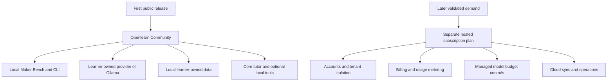
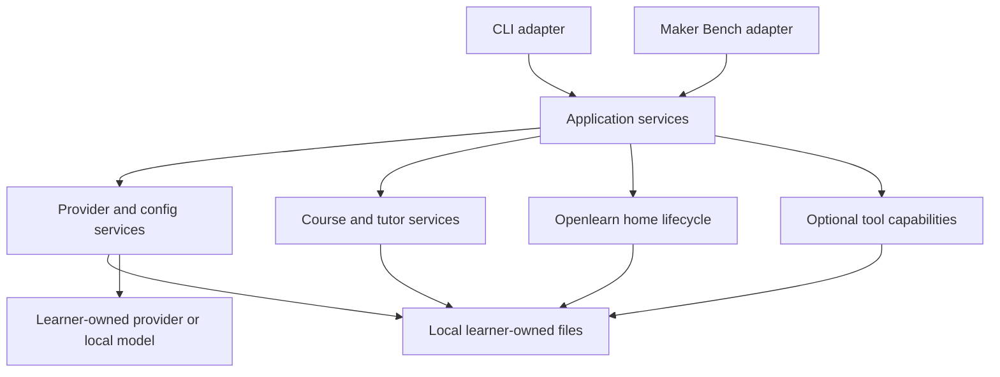
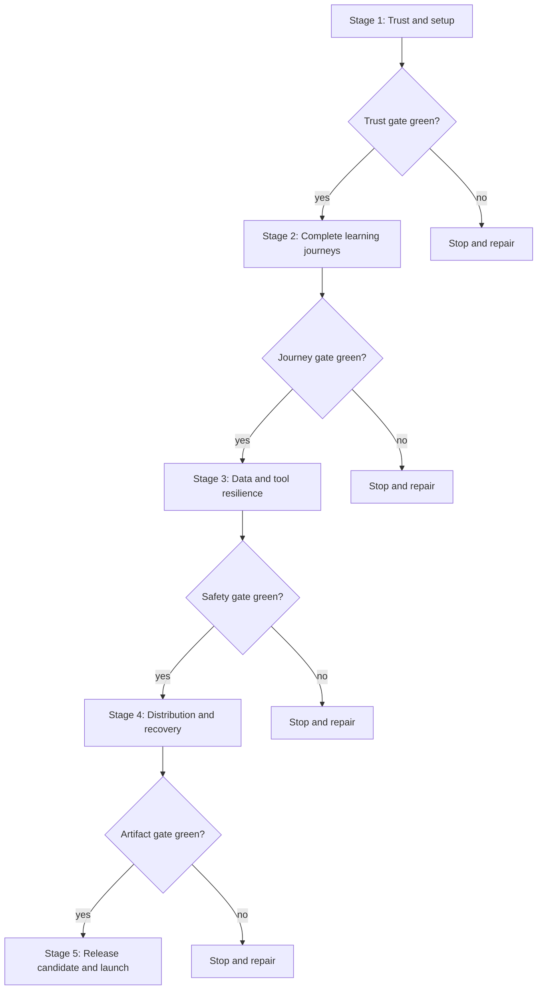

# Openlearn Community First Public Release - Plan

## Goal Capsule

- **Objective:** Release Openlearn Community as a polished, free, local-first AI tutor that individuals can install, configure with their own model access, and use without an Openlearn account.
- **Product authority:** This plan defines the product and release gates for the first public Community release.
- **Open blockers:** None before technical planning.
- **Execution profile:** Deep, cross-interface release work delivered through five green stages.
- **Stop conditions:** Stop if a stage would expose Openlearn beyond loopback, require a maintainer provider key, weaken local data ownership, or change the Community-first Product Contract.
- **Tail ownership:** The final stage owns release-candidate evidence, version and tag validation, publication, and correction or withdrawal readiness.

---

## Product Contract

### Summary

Openlearn Community will be a complete downloadable tutoring product with the Maker Bench web interface, the CLI, local learning data, and bring-your-own model access.
The first public release will not operate a hosted multi-user service or spend maintainer-owned model credits.

### Problem Frame

The current product already has a capable local tutor, a loopback-only web interface, provider setup, course templates, and early learning tools.
It is still experienced as an evolving project rather than a release with a single dependable installation, onboarding, learning, recovery, and support path.

A public release creates a new risk boundary even when the application remains local.
New users must understand who pays for model usage, where their data and credentials live, which features are stable, and how to recover when setup or a provider fails.
The release must make those answers obvious without using a maintainer-owned OpenRouter key or requiring cloud accounts prematurely.

### Key Decisions

- **Release the downloadable Community product before a hosted service** (session-settled: user-directed - chosen over launching local and hosted editions together: the local product can reach users without taking on multi-user security and operating risk).
  Governs R1, R4, R5, R29, R40.
- **Require learner-owned model access for the first release** (session-settled: user-approved - chosen over maintainer-funded trial credits: it prevents anonymous users from consuming the maintainer's OpenRouter balance).
  Governs R2, R3, R7, R8, R9, R30, R45, R46.
- **Reserve managed model access for a later optional subscription** (session-settled: user-directed - chosen over bundling billing into the first release: demand should be demonstrated before Openlearn operates metered AI usage).
  Governs R3 and R40.
- **Sell future hosting and convenience rather than removing local learning capability.**
  Governs R5 and R40.
- **Treat the Maker Bench as the primary approachable interface while retaining the CLI as a supported keyboard-first interface.**
  Governs R20 through R24.
- **Keep optional tools from becoming prerequisites for the core tutor.**
  Governs R25 through R28.

### Actors

- A1. **Learner:** Installs Openlearn, supplies model access, owns learning data, and uses either the Maker Bench or CLI.
- A2. **Maintainer:** Publishes releases, documents supported behavior, receives issue reports, and never supplies a production model credential to Community users.
- A3. **Model provider:** Supplies hosted inference under the learner's account or local inference on the learner's machine.
- A4. **Optional tool runtime:** Supplies bounded code execution or remote media only after the learner explicitly invokes the tool.

### Requirements

**Edition and cost boundary**

- R1. Openlearn Community must be free to download and usable without an Openlearn account or subscription.
- R2. Every hosted model request must use credentials supplied by the learner through their environment or local Openlearn configuration.
- R3. The distributed application and release environment must contain no maintainer-owned provider key, shared fallback credential, or sponsored credit path.
- R4. Course content, learner state, provider configuration, and imported context must remain local and inspectable by default.
- R5. The Community edition must include the complete core tutoring loop rather than a usage-limited demonstration.

**Installation and first launch**

- R6. Each supported desktop platform must have one clearly recommended installation path, plus documented upgrade and uninstall paths.
- R7. First launch must explain that hosted providers charge the learner's account and that Ollama or another local endpoint can be keyless.
- R8. Provider setup must validate required credentials before completion and must never accept a known-rejected key as successful.
- R9. A provider outage or unreachable local model must produce a recoverable choice without falsely claiming that setup succeeded.
- R10. A new learner following the primary setup path must reach the first teaching interaction within five minutes, excluding provider-account creation or model download time.

**Course discovery and learning loop**

- R11. The Maker Bench and CLI must expose starter courses, new course creation, Quick Learn, resume, review, progress, provider settings, and data-management actions through discoverable navigation.
- R12. Technical Interview Prep must ship as the baseline starter course with a structured algorithms and data-structures curriculum.
- R13. Technical Interview Prep placement must ask one rapid 1-5 confidence question at a time, choose coding or system-design topics from the learner's interview focus, and end with a reviewable role-aware outline that the learner can confirm, change, or skip.
- R14. Placement must not require an IDE or code execution, while later course activities may use the optional coding workbench.
- R15. A learner must be able to create a broad custom course for a topic outside the bundled templates without losing the tutor's adaptive teaching behavior.
- R16. Each teaching turn must present one readable learning objective, one primary learner action, and clear controls to answer, pause, or leave the session, while interview courses teach communication and interview habits alongside technical concepts rather than postponing them to a final unit.
- R17. Resume must restore the active course and explain the next useful action without replaying an overwhelming transcript or setup sequence.
- R18. Progress must distinguish current unit, demonstrated mastery, uncertain concepts, due review, and the recommended next action.
- R19. Quick Learn must turn a supported local source or bounded public repository into an immediate local learning session without executing imported content.

**Interface quality and parity**

- R20. The Maker Bench must remain readable at common laptop widths and must not present dense placement, teaching, or progress content as an unbroken wall of text.
- R21. Core flows must support keyboard navigation, visible focus, screen-reader labels, sufficient contrast, and reduced-motion preferences.
- R22. The CLI must remain a supported interface for core course creation, teaching, review, progress, provider setup, and recovery even when richer tools appear first in the Maker Bench.
- R23. Every action exposed only through a shortcut or command must also have a discoverable menu, help, or contextual affordance.
- R24. Validation errors must preserve valid input, identify the field or action that needs attention, and explain how the learner can recover.

**Early learning tools**

- R25. Bounded source import must remain available as an optional course capability with explicit size, file-type, secret-filtering, and non-execution boundaries.
- R26. The YouTube player must require learner consent before remote media loads and must remain optional to complete a course.
- R27. The coding workbench must require an explicit run action, show its runtime limitations, and never claim to reproduce interview conditions or provide placement evidence.
- R28. Missing or unavailable optional tool dependencies must degrade to actionable setup guidance without blocking text-only tutoring.

**Privacy, security, and learner control**

- R29. The web application must remain bound to the local machine and reject non-loopback browser access in the Community release.
- R30. Provider keys must be masked during entry, excluded from application responses and logs, validated only against the selected provider origin, and stored with private local permissions when saved.
- R31. Browser mutations must retain launch authentication, same-origin enforcement, request bounds, and anti-forgery protections.
- R32. Learners must be able to locate, back up, move, export, reset, and delete their Openlearn home without reverse-engineering internal storage.
- R33. Telemetry, analytics, and crash-upload behavior must be absent by default unless a later release introduces a separate explicit opt-in.
- R34. Imported files, repositories, archives, and generated filenames must be bounded against secret exposure, path escape, unsafe links, and unintended execution.
- R35. Optional code execution must remain isolated from learner files and credentials by default and must enforce resource and output limits.

**Compatibility, packaging, and upgrades**

- R36. The supported baseline must include current macOS, Windows, and Linux environments covered by the release test matrix on Python 3.11 through 3.13.
- R37. The Python package and GitHub release artifacts must contain the same web assets, templates, default course behavior, and version information tested from a clean installation.
- R38. Upgrades must preserve compatible learner data and must stop with backup and recovery guidance before applying any destructive or unsupported migration.
- R39. The release documentation must cover install, update, uninstall, provider setup, local-model setup, first course, data location, backup, privacy, troubleshooting, and issue reporting.

**Release operations and trust**

- R40. Hosted accounts, cloud sync, billing, maintainer-funded model usage, and subscription entitlements must remain outside the first Community release.
- R41. Release candidates must pass automated checks, clean-install package smoke tests, browser smoke tests, security regressions, and the documented human learning journeys.
- R42. No known release-blocking defect may remain in provider validation, data preservation, course creation, session resume, or local web access control.
- R43. The public repository must include a license, contribution guidance, security-reporting instructions, privacy explanation, support expectations, and reproducible development checks.
- R44. The maintainer must have a documented procedure to stop or withdraw a broken release, communicate the impact, and publish a corrected version without damaging learner data.

**Provider cost control**

- R45. Provider setup must offer a clearly labeled replaceable low-cost model default without implying that model pricing is controlled by Openlearn.
- R46. A learner must be able to inspect the active provider and model, switch either one, and remove a saved credential without repeating unrelated onboarding.

### Key Flows

- F1. **Clean installation and launch**
  - **Trigger:** A1 discovers Openlearn through the repository or package index.
  - **Actors:** A1, A2
  - **Steps:** The learner follows the recommended platform path, launches Openlearn, and reaches the setup screen.
  - **Outcome:** The application is running locally with the storage and cost model explained.
  - **Covers:** R1, R4, R6, R7, R10, R36, R37.

- F2. **Bring-your-own-provider setup**
  - **Trigger:** A1 chooses a hosted or local provider.
  - **Actors:** A1, A3
  - **Steps:** Openlearn explains provider ownership, collects only required settings, validates the configuration, and presents a recoverable result.
  - **Outcome:** A valid learner-owned provider is ready or the learner knows exactly how to retry, switch, or defer.
  - **Covers:** R2, R3, R7, R8, R9, R30, R45, R46.

- F3. **Start the baseline course**
  - **Trigger:** A1 selects Technical Interview Prep from starter courses.
  - **Actors:** A1
  - **Steps:** Openlearn explains the course, offers the short confidence survey or a direct skip action, lets the learner accept or edit the suggested outline, and starts the first appropriate lesson.
  - **Outcome:** The learner reaches useful teaching without an IDE requirement or a long profile questionnaire.
  - **Covers:** R11, R12, R13, R14, R16.

- F4. **Continue a learning loop**
  - **Trigger:** A1 opens an active course or returns after leaving.
  - **Actors:** A1, A3
  - **Steps:** Openlearn restores compact context, teaches one objective, collects learner evidence, updates progress, and recommends the next action.
  - **Outcome:** The learner can make and recognize durable progress without interface overload.
  - **Covers:** R15, R16, R17, R18, R20, R21, R22.

- F5. **Use an optional tool**
  - **Trigger:** A1 explicitly opens a source, video, or coding activity.
  - **Actors:** A1, A4
  - **Steps:** Openlearn explains the tool boundary, obtains any required consent, performs the bounded action, and returns the learner to the course.
  - **Outcome:** The tool improves the lesson without becoming required infrastructure for the tutor.
  - **Covers:** R19, R25, R26, R27, R28, R34, R35.

- F6. **Upgrade or leave Openlearn**
  - **Trigger:** A1 upgrades, moves to another machine, or stops using Openlearn.
  - **Actors:** A1, A2
  - **Steps:** The learner locates and backs up data, completes the supported action, and verifies whether local data was preserved or removed.
  - **Outcome:** The learner retains control without silent data loss or credential residue.
  - **Covers:** R32, R38, R39, R44.

### Release Boundary

### Acceptance Examples

- AE1. **Covers R2, R3, R7, R8, R30.**
  - **Given:** A fresh learner chooses OpenRouter and has not supplied a key.
  - **When:** The learner tries to complete setup.
  - **Then:** Openlearn explains that a learner-owned key is required and does not send a request using any shared credential.

- AE2. **Covers R8, R9, R24.**
  - **Given:** A learner submits a provider key that the provider rejects.
  - **When:** Validation finishes.
  - **Then:** Setup remains incomplete, the key is not saved as verified, and the learner receives a clear retry or provider-switch path.

- AE3. **Covers R7, R9, R10.**
  - **Given:** A learner selects an available local Ollama endpoint.
  - **When:** Validation succeeds without a key.
  - **Then:** Openlearn proceeds to course selection without requesting a hosted-provider credential.

- AE4. **Covers R11, R12, R13, R14.**
  - **Given:** A fresh learner selects Technical Interview Prep.
  - **When:** The learner skips placement.
  - **Then:** Openlearn starts an appropriate broad baseline plan without claiming that any pattern has been mastered.

- AE5. **Covers R13, R14, R20, R24.**
  - **Given:** A learner starts placement and rates confidence across the interview patterns.
  - **When:** The learner supplies a role, level, and interview focus.
  - **Then:** Openlearn proposes a readable role-aware outline that gives more teaching time to lower-confidence topics, changes its system-design coverage with the selected interview focus, embeds interview habits throughout the units, and treats every self-rating as unverified planning input.

- AE6. **Covers R16, R17, R18, R20.**
  - **Given:** A learner leaves during a course and returns later.
  - **When:** Resume opens the course.
  - **Then:** The learner sees the current objective, compact continuity, progress, and one recommended action rather than a transcript dump.

- AE7. **Covers R19, R25, R34.**
  - **Given:** A learner imports a source containing an unsafe path, link, oversized file, or likely secret.
  - **When:** The import is evaluated.
  - **Then:** The unsafe material is rejected or omitted with an explanation and is never executed.

- AE8. **Covers R26, R28.**
  - **Given:** A lesson offers a YouTube resource.
  - **When:** The learner declines remote-media consent.
  - **Then:** No remote player loads and the learner can continue the lesson through local text.

- AE9. **Covers R27, R28, R35.**
  - **Given:** The optional code runtime is unavailable.
  - **When:** A learner opens a coding activity.
  - **Then:** Openlearn explains the missing dependency and preserves a text-only route through the course.

- AE10. **Covers R29, R31.**
  - **Given:** A non-loopback client, untrusted Host, cross-origin mutation, or unauthenticated browser requests the Community web application.
  - **When:** The request reaches Openlearn.
  - **Then:** Access is rejected without exposing learner data, provider settings, or action capabilities.

- AE11. **Covers R32, R38.**
  - **Given:** A learner upgrades with existing courses and state.
  - **When:** Openlearn encounters an incompatible or unsafe migration.
  - **Then:** It stops before destructive mutation and gives backup and recovery guidance.

- AE12. **Covers R36, R37, R41.**
  - **Given:** A release artifact is installed in a clean supported environment.
  - **When:** The package and browser smoke flows run.
  - **Then:** The installed version launches with bundled assets and completes the baseline setup-to-teaching journey.

- AE13. **Covers R45, R46.**
  - **Given:** A learner completed setup with the recommended inexpensive OpenRouter model.
  - **When:** The learner opens provider settings later.
  - **Then:** Openlearn shows the active provider and model, lets the learner replace either one, and removes a deleted saved key from local configuration.

### Success Criteria

- A new learner can install Openlearn and reach a first teaching interaction in under five minutes, excluding external account creation and local model download time.
- At least five fresh testers on the supported desktop platforms complete installation, provider setup, baseline course start, one teaching interaction, resume, and data-location discovery without maintainer intervention.
- Public Community use creates no model-provider charges on a maintainer-owned account.
- The supported CI matrix, clean-package smoke, browser smoke, security regressions, and human release journeys are green for the release commit and packaged artifacts.
- No open release-blocking issue concerns credential handling, data loss, unusable onboarding, inaccessible core navigation, or bypass of local web controls.
- Documentation enables a new user to install, configure, learn, back up data, report a problem, and uninstall without private maintainer guidance.

<!-- ce-section: work-relationships -->
### How This Work Fits Together

This plan owns the first public Openlearn Community release.
The surrounding areas below are contextual candidates rather than a committed roadmap.

- **Depends on:** The current local tutor, provider, course, learner-state, import, and Maker Bench behavior remaining authoritative.
- **Includes as release gates:** Onboarding polish, core tutor usability, local security, packaging, documentation, and release operations.
- **Includes as optional capabilities:** Source import, consent-based video, and bounded code execution that can fail without blocking the tutor.
- **Enables later:** A separate hosted-subscription plan after the Community release demonstrates demand.
  - The hosted plan must add accounts, tenant isolation, billing, usage metering, abuse prevention, provider-budget caps, and a global spending kill switch.
  - The hosted plan may add cloud sync and managed model access while preserving Community BYOK and local ownership.
- **Can proceed independently of:** Mobile applications, institutional administration, collaboration, and specialist tool libraries.

### Scope Boundaries

**Deferred for later**

- Hosted Openlearn accounts and multi-user course storage.
- A paid subscription, billing portal, entitlements, and cancellation lifecycle.
- Managed model credits, free trials, quotas, rate limits, fraud controls, and a global provider-spend kill switch.
- Cloud synchronization across devices.
- Native desktop installers or application-store distribution beyond the supported Python package path.
- Mobile applications.
- A full interview IDE, autocomplete policy enforcement, video search, transcription, music notation, and other specialist teaching tools.
- Community course-template search, publishing, ratings, likes, and dislikes.
- Anonymous product analytics or remote crash reporting.

**Outside this product's identity**

- Shipping a maintainer-owned provider key to public users.
- Making the core tutor depend on a paid Openlearn subscription.
- Turning Openlearn into a generic chat interface that prioritizes answer delivery over durable learning.
- Uploading private learning data by default.

### Dependencies and Assumptions

- The learner can obtain a hosted-provider credential or run a compatible local model when model-backed teaching is needed.
- Python 3.11 through 3.13 remains an acceptable first-release installation prerequisite on supported desktop platforms.
- The core tutor remains useful when optional code, video, or source tools are unavailable.
- Provider pricing, availability, and model catalogs may change, so defaults must remain replaceable and provider ownership must stay visible.
- The existing AGPLv3 license remains the distribution and hosted-modification boundary for the Community release.

### Sources and Research

- `README.md` for the current local-first product promise, installation path, storage model, and Maker Bench entry point.
- `docs/PLAN.md` for product positioning, BYOK, local ownership, and distribution constraints.
- `docs/plans/2026-08-07-004-feat-local-web-tutor-mvp-plan.md` for Maker Bench behavior and the local browser security boundary.
- `docs/plans/2026-08-07-005-feat-early-web-tools-plan.md` for optional tool boundaries.
- `docs/DEVELOPMENT.md` and `.github/workflows/` for the current verification and package-release machinery.
- `src/openlearn/config.py`, `src/openlearn/providers.py`, and `src/openlearn/web/security.py` for credential ownership, validation, storage, and loopback-only access.

---

## Planning Contract

**Product Contract preservation:** Product Contract unchanged.

### Assumptions

- The implementation covers the full Community release contract rather than a narrower preview release.
- Existing application, provider, storage, local-security, and release boundaries will be extended instead of replaced.
- Learners may browse starter courses and complete offline placement before validating a model provider.
- Python 3.11, 3.12, and 3.13 remain the supported first-release runtime range.
- Native installers remain deferred, so the first release uses the Python package and GitHub release artifacts.
- Optional tools ship with the Community package but may report an unavailable capability without blocking the tutor.
- Archive import remains unsupported unless implementation adds a bounded extractor and the matching security tests.
- Whole-home exports exclude saved provider credentials by default and require a separate explicit opt-in to include them.
- The exact public version number is selected during the release-candidate stage after all prior gates pass.

### Key Technical Decisions

- KTD1. **Close verified gaps instead of rewriting foundations.** Extend the existing provider, application, local-security, course, tool, and release patterns because they already carry substantial regression coverage.
- KTD2. **Put shared behavior below the interfaces.** New provider, placement, review, progress, Quick Learn, and data-lifecycle behavior belongs in presentation-neutral services that CLI and web adapters both call.
- KTD3. **Make the provider module authoritative before expanding setup UI.** Route CLI and web catalog, validation, persistence, and redacted errors through `src/openlearn/providers.py`, while environment credentials require validation or the existing explicit verified override.
- KTD4. **Permit offline navigation before provider validation.** Apply provider readiness only to model-backed actions so course browsing and offline Technical Interview Prep placement remain available.
- KTD5. **Build whole-home backup before destructive data actions.** Inventory and verify all learner-owned files before move, reset, delete, or unsupported migration handling is enabled.
- KTD6. **Keep optional tools capability-gated.** Tool failures return actionable guidance and preserve a text-only course path without weakening each tool's current security boundary.
- KTD7. **Promote immutable release-candidate artifacts.** Build wheel and source distributions once, record their hashes, test those exact files across supported environments, and publish without rebuilding.
- KTD8. **Use stage gates as the release control plane.** Each stage must leave the full repository green and produce durable evidence before dependent work starts.

### High-Level Technical Design

The first diagram shows the existing shared-service boundary that each stage extends.

The second diagram defines the dependency order and the release stop points.

### Phased Delivery

#### Stage 1: Trust and provider setup

- **Units:** U1 and U2.
- **Goal:** Establish one shared lifecycle boundary and a provider flow that cannot use maintainer credits or falsely accept rejected credentials.
- **Entry:** Current `main` passes the repository green gate.
- **Exit:** CLI and Maker Bench show the same active provider state, support safe switching and key removal, distinguish provider failures, and allow provider-free course browsing and offline placement.

#### Stage 2: Complete learning journeys

- **Units:** U3 and U5.
- **Goal:** Make the Maker Bench a readable primary interface without reducing CLI capability.
- **Entry:** Stage 1 is green.
- **Exit:** Starter courses, Technical Interview Prep, custom courses, Quick Learn, review, progress, resume, and recovery complete through discoverable and accessible flows.

#### Stage 3: Data and optional-tool resilience

- **Units:** U4 and U6.
- **Goal:** Give learners whole-home control and ensure bundled tools fail safely.
- **Entry:** Stage 2 is green.
- **Exit:** Backup precedes destructive data actions, unsafe imports are rejected, remote media remains consent-based, and unavailable code execution preserves text tutoring.

#### Stage 4: Distribution and recovery

- **Units:** U7.
- **Goal:** Turn the repository into a reproducible public package with complete user and maintainer documentation.
- **Entry:** Stage 3 is green.
- **Exit:** Clean wheel and source-distribution journeys pass across the supported matrix, artifacts contain no private data or provider credentials, and recovery procedures are documented.

#### Stage 5: Release candidate and launch

- **Units:** U8.
- **Goal:** Prove the product with fresh users and publish only from verified artifacts.
- **Entry:** Stage 4 is green and no release-blocking issue remains.
- **Exit:** The release candidate satisfies the success criteria, the version and tag agree, publication completes, and the correction or withdrawal path is ready.

### System-Wide Impact

- **Learners:** Setup, navigation, data ownership, and error recovery become public contracts across both interfaces.
- **Maintainer:** Release work gains explicit artifact, dogfood, publication, and withdrawal gates.
- **Storage:** Existing Markdown, JSON, JSONL, context, interview, and workspace files remain authoritative while a whole-home lifecycle service coordinates them.
- **Security:** The loopback browser boundary remains unchanged, while provider and import paths receive stronger release evidence.
- **Compatibility:** Package, CLI, web assets, and data migrations are verified from installed distributions across supported Python and operating-system combinations.

### Risks and Mitigations

- **Duplicated configuration state can drift between interfaces.** U1 establishes one shared mutation path or adds parity characterization before U2 expands provider controls.
- **Provider gating can block offline product value.** U2 separates offline navigation from model-backed readiness and tests both paths.
- **Whole-home reset can destroy credentials or learner evidence.** U4 requires verified backup and explicit confirmation before destructive actions.
- **Secret scanning can create false positives or false confidence.** U6 uses bounded likely-secret detection, explains omissions, and never claims comprehensive secret discovery.
- **Optional OCI execution can be mistaken for access to real learner files.** U6 preserves temporary-copy isolation and documents the boundary.
- **A tag-triggered workflow can partially publish.** U7 gates publication on installed artifacts and documents correction or withdrawal before U8 tags the release.
- **A broad release plan can regress already-finished behavior.** Every unit starts from characterization or focused regression coverage and ends with the repository green gate.

### Sources and Research

- `src/openlearn/application.py` provides the presentation-neutral seam for CLI and Maker Bench parity.
- `src/openlearn/config.py` and `src/openlearn/providers.py` own current credential precedence, validation, and private persistence.
- `src/openlearn/web/security.py` and `src/openlearn/web/launcher.py` own the loopback browser boundary.
- `src/openlearn/courses.py` provides idempotent course creation and interview-profile creation patterns.
- `src/openlearn/source_imports.py`, `src/openlearn/video_tools.py`, `src/openlearn/code_runner.py`, and `src/openlearn/code_workspace.py` own optional-tool safety boundaries.
- `tests/test_package_assets.py`, `.github/workflows/tests.yml`, and `.github/workflows/release.yml` define the current artifact and release baseline.
- No `CONCEPTS.md` or institutional `solutions/` corpus exists, so current code and prior plans are the planning authority.

---

## Implementation Units

### U1. Canonical release lifecycle services

- **Goal:** Establish shared provider mutation and Openlearn-home inventory services before either interface adds release-facing controls.
- **Requirements:** R2-R4, R29-R33, R45-R46; A1-A3; F2.
- **Dependencies:** None.
- **Files:** `src/openlearn/application.py`, `src/openlearn/config.py`, `src/openlearn/providers.py`, `src/openlearn/cli.py`, `src/openlearn/web/services.py`, `src/openlearn/data_management.py`, `tests/test_application.py`, `tests/test_config.py`, `tests/test_providers.py`, `tests/test_cli.py`, `tests/test_web.py`.
- **Approach:**
  1. Characterize configuration precedence, duplicate validation, provider mutation, and secret-redacted status before changing ownership.
  2. Make the provider module the sole catalog, validation, persistence, and redacted-error implementation for both interfaces.
  3. Add presentation-neutral operations for provider status, provider replacement, saved-key removal, and whole-home inventory.
  4. Make CLI and web adapters call the shared operations without parsing each other's output.
  5. Keep environment-managed values visible but immutable through local UI mutations.
- **Execution note:** Add parity characterization before consolidating duplicated provider and configuration behavior.
- **Patterns to follow:** Immutable application DTOs in `src/openlearn/application.py`, atomic private writes in `src/openlearn/config.py`, and injected provider transports in `tests/test_providers.py`.
- **Test scenarios:**
  - A saved provider update becomes visible immediately through CLI and Maker Bench status.
  - Environment-managed provider fields remain authoritative and cannot be overwritten by a local form action.
  - Environment-managed credentials remain not ready until validated or marked by the explicit verified override.
  - Remote plain HTTP, redirects, control characters, and raw network details are rejected consistently through CLI and web setup.
  - Removing a saved key deletes it without echoing the old value in status, logs, exceptions, or responses.
  - A whole-home inventory includes course, state, event, interview, context, drill, workspace, and configuration classes while excluding ephemeral web lease data from export candidates.
  - A malformed config produces redacted recovery metadata instead of exposing file contents.
- **Verification:** Both interfaces report identical public provider state and inventory summaries from isolated homes.

### U2. Provider onboarding and offline entry

- **Goal:** Make first launch, provider recovery, model-cost ownership, and provider-free entry consistent across CLI and Maker Bench.
- **Requirements:** R6-R10, R30, R45-R46; F1-F3; AE1-AE4, AE13.
- **Dependencies:** U1.
- **Files:** `src/openlearn/constants.py`, `src/openlearn/onboarding.py`, `src/openlearn/providers.py`, `src/openlearn/cli.py`, `src/openlearn/web/routes.py`, `src/openlearn/web/schemas.py`, `src/openlearn/web/services.py`, `src/openlearn/web/templates/setup.html`, `src/openlearn/web/static/openlearn.js`, `tests/test_onboarding.py`, `tests/test_providers.py`, `tests/test_cli.py`, `tests/test_web.py`, `tests/test_web_browser.py`.
- **Approach:**
  1. Reconcile CLI and web provider defaults through one replaceable low-cost OpenRouter recommendation.
  2. Preserve the existing rejected, unreachable, invalid-response, and valid result distinctions while confirming that the selected model is usable.
  3. Preserve non-secret fields for every failure and retain the secret in the current page only for retryable network failures.
  4. Apply provider readiness only when a model-backed action begins.
  5. Expose active provider, model, switching, and key removal after onboarding.
- **Patterns to follow:** `ValidationStatus`, provider preset metadata, `persist_validation_result()`, keyless-loopback detection, and existing setup browser tests.
- **Test scenarios:**
  - Covers AE1. Blank required OpenRouter credentials keep setup incomplete and send no provider request.
  - Covers AE2. A rejected key remains unverified and cannot be saved through a retry or stale form submission.
  - An unreachable provider preserves entered provider and model values and offers retry, switch, or explicit unverified save only where current policy allows it.
  - A rejected credential clears the in-page secret, while a retryable network failure retains it only for the current page session.
  - A provider endpoint that responds successfully but does not expose the selected model remains not ready.
  - Covers AE3. A reachable local Ollama endpoint proceeds without a key.
  - A learner can browse starters and complete or skip offline Technical Interview Prep placement before configuring a provider.
  - Covers AE13. Provider settings show the active provider and model, allow replacement, and remove a saved key.
  - The recommended model is labeled inexpensive and replaceable without promising provider-controlled pricing.
- **Verification:** Fresh CLI and Maker Bench journeys reach offline course entry, and model-backed teaching remains locked until valid provider readiness exists.

### U3. Complete Maker Bench learning parity

- **Goal:** Expose the complete core learning journey through discoverable Maker Bench actions backed by shared domain services.
- **Requirements:** R11-R19, R22-R24; A1, A3; F3-F4; AE4-AE6.
- **Dependencies:** U1, U2.
- **Files:** `src/openlearn/application.py`, `src/openlearn/courses.py`, `src/openlearn/tutor_service.py`, `src/openlearn/interview_prep.py`, `src/openlearn/web/app.py`, `src/openlearn/web/routes.py`, `src/openlearn/web/schemas.py`, `src/openlearn/web/services.py`, `src/openlearn/web/templates/dashboard.html`, `src/openlearn/web/templates/course_create.html`, `src/openlearn/web/templates/focus.html`, `src/openlearn/web/templates/history.html`, `src/openlearn/web/static/openlearn.js`, `tests/test_application.py`, `tests/test_courses.py`, `tests/test_interview_prep.py`, `tests/test_tutor_service.py`, `tests/test_web.py`, `tests/test_web_browser.py`.
- **Approach:**
  1. Preserve template entry mode through the application and web projections.
  2. Route Technical Interview Prep through one-at-a-time offline confidence questions, focus-specific topic selection, role-aware outline generation, explicit outline confirmation or editing, and direct skip before model lesson initialization.
  3. Add discoverable Quick Learn, due review, detailed progress, resume, settings, and data-management entry points.
  4. Extract shared operations where the current behavior exists only behind CLI handlers.
  5. Keep revision, idempotency, and conflict behavior consistent with existing course and tutor services.
- **Execution note:** Start with end-to-end web journey tests for the baseline interview course and a generic custom course.
- **Patterns to follow:** Course submission idempotency in `src/openlearn/courses.py`, tutor operation lifecycle in `src/openlearn/tutor_service.py`, and application DTO projection in `src/openlearn/application.py`.
- **Test scenarios:**
  - Covers AE4. Skipping Technical Interview Prep placement starts a broad baseline lesson without marking self-reported mastery after provider readiness.
  - Covers AE5. The rapid survey produces a readable role-aware outline without opening an editor or asking a coding question.
  - Placement survey and outline state resume after browser reload or process restart without duplicating events.
  - Quick Learn creates a separate course from a supported source and reaches teaching without outline approval.
  - A due-review count links to an actionable review flow and updates after grading.
  - Covers AE6. Resume shows compact continuity, current objective, progress, and one next action.
  - A custom non-template topic reaches the same tutor loop and progress model as a starter course.
  - Concurrent stale browser actions return recoverable conflict guidance without overwriting newer state.
- **Verification:** Browser tests complete Technical Interview Prep, custom-course, Quick Learn, review, progress, and resume journeys while CLI regression suites remain green.

### U4. Whole-home data ownership lifecycle

- **Goal:** Give learners verified backup, export, move, reset, and deletion paths for the complete Openlearn home.
- **Requirements:** R4, R32, R38-R39; A1-A2; F6; AE11.
- **Dependencies:** U1, U3.
- **Files:** `src/openlearn/data_management.py`, `src/openlearn/application.py`, `src/openlearn/cli.py`, `src/openlearn/web/app.py`, `src/openlearn/web/routes.py`, `src/openlearn/web/schemas.py`, `src/openlearn/web/services.py`, `src/openlearn/web/templates/data_settings.html`, `tests/test_data_management.py`, `tests/test_cli.py`, `tests/test_config.py`, `tests/test_courses.py`, `tests/test_windows_attempt_io.py`, `tests/test_web.py`.
- **Approach:**
  1. Define one inventory and manifest for persistent files, exported files, and excluded ephemeral files.
  2. Build verified backup and export before move, reset, and delete actions.
  3. Use atomic staging and the existing Windows-safe adjacent-file patterns for moves and replacements.
  4. Add schema and compatibility preflight that stops before unsupported destructive migration.
  5. Exclude saved credentials by default and require explicit scope confirmation for credential-inclusive backup and destructive reset or deletion.
- **Execution note:** Implement inventory and round-trip backup tests before any destructive action.
- **Patterns to follow:** Atomic writes in `src/openlearn/config.py`, course mutation locks in `src/openlearn/courses.py`, adjacent file handling in `src/openlearn/windows_attempt_io.py`, and topic backup behavior in `src/openlearn/cli.py`.
- **Test scenarios:**
  - A complete isolated home exports to a manifest-backed archive and restores byte-equivalent persistent files.
  - Backup excludes locks, sockets, leases, temporary work, and unrelated files outside the resolved home.
  - A credential-inclusive backup requires a clear warning and preserves private archive permissions where supported.
  - A default export contains provider identity and model metadata but no saved API key.
  - Reset and delete refuse to proceed when backup verification fails.
  - Covers AE11. An unsupported migration stops before mutation and identifies backup and recovery actions.
  - Move failure leaves the original home valid and removes incomplete staging artifacts.
  - CLI and Maker Bench data summaries and destructive scopes agree.
- **Verification:** Round-trip tests prove data preservation, destructive tests prove backup-first refusal, and both interfaces expose the same lifecycle semantics.

### U5. Readability and accessibility release gate

- **Goal:** Make setup, placement, teaching, progress, recovery, and data controls readable and fully keyboard-operable at supported viewport sizes.
- **Requirements:** R16-R18, R20-R24; A1; F3-F4; AE5-AE6.
- **Dependencies:** U2, U3.
- **Files:** `src/openlearn/web/templates/base.html`, `src/openlearn/web/templates/setup.html`, `src/openlearn/web/templates/dashboard.html`, `src/openlearn/web/templates/course_create.html`, `src/openlearn/web/templates/course_initializing.html`, `src/openlearn/web/templates/focus.html`, `src/openlearn/web/templates/history.html`, `src/openlearn/web/templates/data_settings.html`, `src/openlearn/web/static/openlearn.css`, `src/openlearn/web/static/openlearn.js`, `tests/test_package_assets.py`, `tests/test_web_browser.py`.
- **Approach:**
  1. Keep one primary learner action and compact secondary controls in each state.
  2. Preserve focus through validation, drawers, tools, placement sections, navigation, and recovery.
  3. Validate headings, landmarks, labels, live regions, expanded state, contrast, reduced motion, and target size.
  4. Test common laptop widths and the 320-pixel minimum without horizontal overflow or hidden actions.
  5. Add an automated accessibility scan only if it is deterministic in the existing browser lane.
- **Patterns to follow:** Existing focus-visible, reduced-motion, live-region, escaped-content, and Playwright viewport assertions.
- **Test scenarios:**
  - A keyboard-only learner completes setup, placement, one teaching response, progress inspection, and return navigation.
  - Validation moves focus to a useful summary or field while preserving valid entries.
  - Opening and closing every drawer or tool restores focus to the invoking control and updates expanded state.
  - Status changes for provider validation, lesson generation, saved drafts, and errors are announced without duplicate noise.
  - Setup, placement, focus, progress, and data pages remain readable at 320 pixels and common laptop widths.
  - Reduced-motion mode removes non-essential motion without hiding progress or state changes.
  - Primary text and controls meet the documented contrast and target-size expectations.
- **Verification:** The representative browser journey passes keyboard, focus, responsive, contrast, and accessibility assertions without weakening performance or security headers.

### U6. Optional-tool safety and graceful degradation

- **Goal:** Close import and runtime gaps while preserving explicit consent, bounded execution, and text-only course continuity.
- **Requirements:** R19, R25-R28, R34-R35; A1, A4; F5; AE7-AE9.
- **Dependencies:** U3.
- **Files:** `src/openlearn/source_imports.py`, `src/openlearn/cli.py`, `src/openlearn/video_tools.py`, `src/openlearn/code_runner.py`, `src/openlearn/code_workspace.py`, `src/openlearn/web/services.py`, `src/openlearn/web/templates/focus.html`, `src/openlearn/web/static/openlearn.js`, `tests/test_source_imports.py`, `tests/test_video_tools.py`, `tests/test_code_runner.py`, `tests/test_code_workspace.py`, `tests/test_web.py`, `tests/test_web_security.py`, `tests/test_code_runner_live.py`.
- **Approach:**
  1. Add bounded likely-secret inspection before permitted source content is persisted.
  2. Reject unsupported archives instead of unpacking them through an unbounded path.
  3. Preserve canonical YouTube validation and consent before remote media loads.
  4. Keep code execution inside a temporary copy with the current OCI restrictions and explicit runtime limitations.
  5. Keep local-only tool preparation available without provider readiness when it does not request model output.
  6. Return tool-specific recovery guidance while retaining the text lesson.
- **Patterns to follow:** Source path containment, canonical video descriptors, digest-pinned OCI configuration, and output/resource bounds.
- **Test scenarios:**
  - Covers AE7. Unsafe paths, links, oversized sources, unsupported archives, and likely credentials are rejected or omitted before persistence.
  - A likely-secret match reports the affected source without echoing the secret value.
  - Covers AE8. Declined media consent loads no remote player and leaves the lesson usable.
  - Covers AE9. Missing Docker or Podman reports setup guidance and preserves text-only progress.
  - Code execution receives no learner credential or host environment and cannot access the real course directory.
  - Timeout, output overflow, process overflow, and disk overflow terminate the complete process group and preserve the saved draft.
  - Tool route mutations remain protected by the local browser security boundary.
  - Local source, video preparation, and code-workspace actions do not redirect to provider setup unless the requested action needs a model call.
- **Verification:** Focused unit tests, web security tests, and the opt-in live OCI lane prove bounded failure without blocking the tutor.

### U7. Installed-artifact and release operations

- **Goal:** Make distribution, documentation, and publication consume the same verified artifacts and journeys that users receive.
- **Requirements:** R1, R5-R7, R10, R36-R44; A1-A3; F1, F6; AE12.
- **Dependencies:** U2-U6.
- **Files:** `pyproject.toml`, `src/openlearn/__init__.py`, `tests/test_package_assets.py`, `.github/workflows/tests.yml`, `.github/workflows/ci-smoke.yml`, `.github/workflows/release.yml`, `Makefile`, `README.md`, `CONTRIBUTING.md`, `SECURITY.md`, `docs/INSTALL.md`, `docs/DATA_AND_PRIVACY.md`, `docs/TROUBLESHOOTING.md`, `docs/RELEASING.md`, `manual-tests/README.txt`, `manual-tests/smoke-full.sh`.
- **Approach:**
  1. Declare the complete Python and operating-system support contract in package metadata and documentation.
  2. Build wheel and source-distribution release candidates once, record their hashes, and run clean installed CLI and Maker Bench journeys against those exact files.
  3. Inspect distributions for required assets and forbidden credentials, private topics, state, context, and development artifacts.
  4. Make tag publication promote the verified release-candidate hashes and depend on the full automated and artifact gates.
  5. Document installation, upgrade, uninstall, provider ownership, local models, data paths, backup, privacy, troubleshooting, support, and corrected-release handling.
- **Execution note:** Prefer clean-install and installed-runtime proof over adding unit coverage for workflow-only changes.
- **Patterns to follow:** Current build-once release job, dynamic version source, cross-platform test matrix, package asset smoke, and trusted PyPI publishing.
- **Test scenarios:**
  - Covers AE12. Clean wheel and source-distribution installs launch the CLI and Maker Bench with templates, catalogs, and static assets.
  - Supported Python versions on macOS, Windows, and Linux complete the applicable installed-package smoke journey.
  - Package metadata, module version, CLI version, and release tag agree.
  - Artifact inspection fails when a provider-shaped secret or learner-data fixture appears outside an explicit test package boundary.
  - Publish remains blocked when any required test, browser, package, or security gate fails.
  - Artifact hashes remain identical from release-candidate dogfood through PyPI and GitHub publication.
  - A simulated partial publication follows the documented correction or withdrawal decision path.
  - Installation, upgrade, uninstall, and data-retention documentation match observed clean-environment behavior.
- **Verification:** CI proves built artifacts across supported environments and the release runbook can recover from a failed or partial publication without learner-data mutation.

### U8. Release-candidate dogfood and public launch

- **Goal:** Validate the complete Community experience with fresh users before selecting the version and publishing the first public release.
- **Requirements:** R10-R18, R20-R24, R32, R39-R44; A1-A3; F1-F6; AE1-AE13.
- **Dependencies:** U7.
- **Files:** `manual-tests/public-release.md`, `manual-tests/README.txt`, `docs/RELEASING.md`, `TODO.md`, `src/openlearn/__init__.py`.
- **Approach:**
  1. Run the immutable release-candidate artifacts from U7 in isolated homes rather than editable source checkouts.
  2. Collect only consented, secret-free pass or failure evidence for each public journey.
  3. Require at least five fresh testers to complete the documented release journey without maintainer intervention.
  4. Triage every failure as release-blocking, follow-up, or documentation-only before publication.
  5. Select the version, verify tag and artifact-hash parity, promote the verified files, and confirm the public install path from a clean environment.
- **Execution note:** Treat manual learning evidence and post-publish clean installation as release gates, not optional polish.
- **Patterns to follow:** Isolated `OPENLEARN_HOME` smoke runs, sanitized dogfood evidence, version/tag parity, and repository review evidence.
- **Test scenarios:**
  - Five fresh testers complete install, provider setup or Ollama setup, baseline course start, one teaching turn, resume, progress inspection, and data-location discovery.
  - At least one tester completes the generic custom-course path and one completes Quick Learn.
  - At least one tester skips Technical Interview Prep placement and one completes and edits the rapid confidence outline.
  - A tester recovers from a rejected key, an unreachable provider, and an unavailable optional tool without losing course state.
  - No release evidence contains an API key, private topic content, imported source content, or raw model prompt.
  - The published package installs cleanly and reports the expected version after PyPI and GitHub release completion.
- **Verification:** The release checklist records all required journeys as passed, every blocker is closed, and the public artifact matches the verified candidate.

---

## Verification Contract

| Gate | Command or evidence | Applies to | Pass signal |
| --- | --- | --- | --- |
| Focused behavior | Targeted `pytest` or `unittest` files named by each unit | U1-U6 | Every unit scenario passes in an isolated Openlearn home. |
| Repository green gate | `make check` | U1-U8 | Lint, unit, pytest, mock smoke, and full mock E2E pass. |
| Review evidence | `make review` | Each stage boundary | The evidence bundle records a green gate and the scoped diff. |
| Browser journey | Playwright lane in `tests/test_web_browser.py` | U2, U3, U5 | Setup, placement, teaching, progress, data, and recovery journeys pass. |
| Package artifacts | `tests/test_package_assets.py` and installed wheel/source-distribution CI | U7 | Clean artifacts contain required assets, exclude forbidden data, and launch both interfaces. |
| Cross-platform matrix | GitHub Actions on macOS, Windows, and Linux with Python 3.11-3.13 | U7 | All applicable package and core journey jobs pass. |
| OCI boundary | `make oci-live` with the pre-provisioned pinned image | U6, U7 | Docker and Podman lanes pass where explicitly provisioned. |
| Human release journey | `manual-tests/public-release.md` | U8 | Five fresh testers complete the required journeys without maintainer intervention. |
| Publication verification | Clean post-publish install plus version check | U8 | PyPI, GitHub release, package metadata, module version, CLI version, and tag agree. |

Behavioral tutor evals remain diagnostic unless a changed unit modifies tutor prompts, judging, mastery, or move selection.
When such behavior changes, run the affected calibrated evaluator and record the result without substituting it for deterministic tests.

---

## Definition of Done

- The Product Contract remains unchanged and every applicable R, F, and AE is traced to an implementation unit or explicit deferred scope.
- U1 through U8 satisfy their test scenarios and verification outcomes in dependency order.
- Every stage boundary passes `make review` before the next stage begins.
- CLI and Maker Bench expose the complete core Community journey through shared behavior rather than duplicated interface-specific rules.
- No distributed artifact, release environment, log, response, or dogfood record contains a maintainer provider key or private learner data.
- Whole-home backup is verified before reset, deletion, move, or unsupported migration handling can mutate learner data.
- Optional tools fail closed and preserve text-only tutoring.
- Built wheel and source-distribution artifacts pass the supported cross-platform matrix and clean installation journeys.
- Public documentation matches the observed install, provider, data, privacy, troubleshooting, uninstall, and recovery behavior.
- Five fresh testers complete the release journey without maintainer intervention.
- No release-blocking issue remains and the correction or withdrawal procedure has been rehearsed.
- Abandoned experiments, duplicate compatibility paths, stale generated output, and temporary release artifacts are removed before completion.
