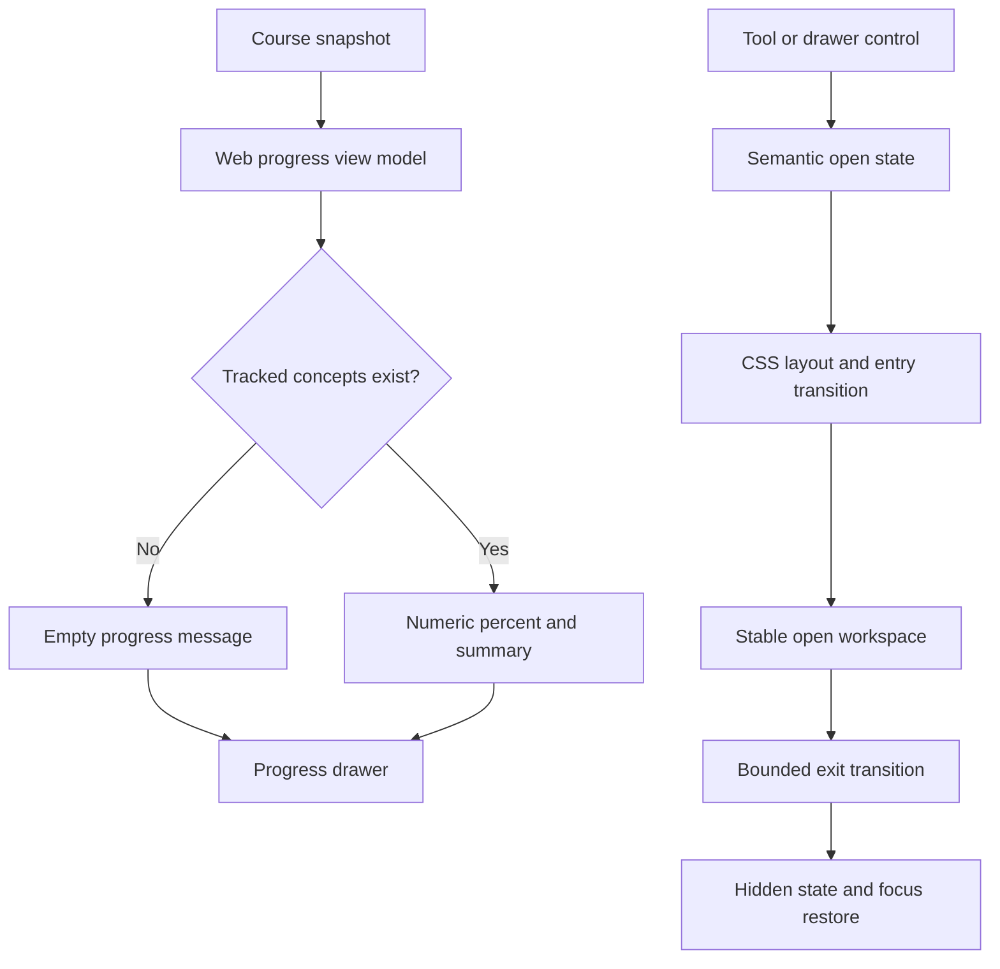

# Web Focus Bench Stabilization - Plan

## Goal Capsule

- Correct learner-facing course progress so no internal mapping or duplicate value reaches the page.
- Turn the existing Dual Surface into a spacious, responsive study workspace with restrained motion.
- Preserve the current local-first tool behavior, unsent learner input, keyboard focus, narrow-screen replacement behavior, and fast initial render.
- Land the verified work on local `main` without adding frontend dependencies or pushing remotely.

---

## Product Contract

### Summary

This plan fixes progress presentation first, then polishes the existing Focus Bench and Dual Surface for sustained study on laptop and desktop screens.
The work keeps the default lesson compact and makes extra space available only when the learner opens a tool.

### Problem Frame

The progress drawer currently falls back from a numeric zero to the complete progress mapping.
That produces Python-style internal data, duplicated text, and an invalid percent suffix in the learner interface.

The Focus Bench is also constrained by the global page measure, so its active Dual Surface cannot use the wider grid already declared for it.
The tool and secondary drawers appear or disappear abruptly, which makes the workspace feel less intentional than the rest of Maker Bench.

### Requirements

**Progress correctness**

- R1. Focus Bench shows a bounded numeric percentage and never interpolates the complete progress mapping.
- R2. A course with no tracked concepts shows a useful empty state instead of treating `0 of 0` as measured progress.
- R3. A course with tracked concepts shows one percentage, one summary, and one accessible progress element without duplicate text.

**Workspace layout**

- R4. The default lesson remains a focused single surface with a readable text measure.
- R5. Opening a tool allows Focus Bench to use available laptop and desktop width without horizontal overflow.
- R6. The lesson and tool receive balanced, useful dimensions, while the active tool may receive a modest width preference on wider screens.
- R7. At narrow widths, the active tool replaces the lesson surface and all controls remain reachable.

**Motion, access, and performance**

- R8. Tool and secondary drawer transitions feel connected to their opener and never discard unsent tutor or tool input.
- R9. Closing restores focus to the invoking control, while reduced-motion mode removes non-essential movement.
- R10. Polish uses existing HTML, CSS, and small event-state changes with no new dependency, polling loop, continuous animation, or layout measurement.

### Scope Boundaries

- The work does not add tools, change tool storage, alter tutor behavior, or redesign the Maker Bench visual language.
- The work does not introduce a client framework, animation package, build step, or JavaScript-driven responsive sizing.
- The code editor, video player, and source-import feature contracts remain unchanged.

### Acceptance Examples

- AE1. Given a new course with zero tracked concepts, when the learner opens Progress, then the drawer says that progress will appear after learning begins and renders no mapping representation.
- AE2. Given a course with tracked concepts, when the learner opens Progress, then one numeric percentage and one plain-language summary agree.
- AE3. Given a 1280-pixel or wider viewport, when the learner opens Code, then the lesson and workbench fill the useful page area without overlapping or creating horizontal scroll.
- AE4. Given an unsent tutor response, when the learner opens and closes a tool, then the response remains and focus returns to the opener.
- AE5. Given reduced-motion preference, when a tool or drawer opens or closes, then the final state changes without non-essential animation.

---

## Planning Contract

### Key Technical Decisions

- KTD1. **Normalize progress in the web view model.** Templates receive explicit `percent`, `summary`, and empty-state information so presentation does not depend on truthiness or mixed scalar/mapping shapes.
- KTD2. **Give Focus Bench an explicit wide page variant.** A template-owned main class overrides the global measure only for the learning workspace and avoids broad dashboard layout changes.
- KTD3. **Use bounded CSS-first motion.** One-shot transform and opacity transitions communicate opening and closing, while JavaScript only coordinates semantic state, `hidden`, URL state, and focus.
- KTD4. **Keep responsive sizing declarative.** CSS grid and viewport breakpoints own layout; JavaScript performs no element measurement or resize-loop work.

### High-Level Technical Design

### Assumptions

- The current Maker Bench palette, typography, controls, tool contracts, and narrow-screen tool replacement remain authoritative.
- Common laptop widths start near 1024 pixels, while the existing 760-pixel breakpoint remains the compact-mode boundary unless browser evidence shows a small adjustment is necessary.
- Performance is protected by dependency-free styles, one-shot transitions, and the absence of resize observers or repeated layout reads.

---

## Implementation Units

### U1. Correct the progress presentation contract

- **Goal:** Render accurate, useful progress for zero-concept and tracked-concept courses.
- **Requirements:** R1-R3; AE1-AE2.
- **Dependencies:** None.
- **Files:** `src/openlearn/web/services.py`, `src/openlearn/web/templates/focus.html`, `tests/test_web.py`, `tests/test_web_browser.py`.
- **Approach:** Build one explicit Focus Bench progress view model, remove template truthiness fallbacks, and render the empty state without a meaningless progress bar.
- **Execution note:** Add failing zero-state and nonzero-state presentation coverage before changing the service and template.
- **Patterns to follow:** `_card` and `OpenLearnWebServices.focus` projections in `src/openlearn/web/services.py`, plus structured focus rendering tests in `tests/test_web.py`.
- **Test scenarios:**
  - A zero-concept snapshot renders no mapping syntax, no `0 of 0`, and no duplicated percent value.
  - A tracked snapshot renders its exact bounded percentage, known/total summary, and progress value once.
  - A malformed or out-of-range internal percentage cannot create an invalid HTML progress value.
- **Verification:** Service and HTTP tests prove the learner-facing contract, and browser inspection confirms the empty and measured states read naturally.

### U2. Expand and balance the Focus Bench workspace

- **Goal:** Use available desktop space while preserving a readable single-surface lesson and compact responsive behavior.
- **Requirements:** R4-R7, R10; AE3.
- **Dependencies:** U1.
- **Files:** `src/openlearn/web/templates/base.html`, `src/openlearn/web/templates/focus.html`, `src/openlearn/web/static/openlearn.css`, `tests/test_package_assets.py`, `tests/test_web.py`, `tests/test_web_browser.py`.
- **Approach:** Add a Focus Bench page-measure hook, tune the rail and dual-column grid with bounded minimums and maximums, increase useful panel height, and preserve the existing tool replacement below the compact breakpoint.
- **Patterns to follow:** Existing `--measure`, `.focus-shell`, `.focus-shell[data-tool-active]`, sticky tool, and 760/390-pixel responsive rules in `src/openlearn/web/static/openlearn.css`.
- **Test scenarios:**
  - The default Focus Bench retains a readable lesson measure at desktop width.
  - The active Dual Surface uses materially more of a 1280-pixel viewport without horizontal overflow.
  - The active tool and lesson remain usable at common laptop width.
  - At 760 pixels and 320 pixels, the active tool replaces the lesson and controls remain visible without page overflow.
- **Verification:** Browser geometry assertions and screenshots confirm balanced dimensions at wide desktop, laptop, and narrow viewports.

### U3. Add restrained tool and drawer transitions

- **Goal:** Make workspace changes feel deliberate without adding persistent runtime cost.
- **Requirements:** R8-R10; AE4-AE5.
- **Dependencies:** U2.
- **Files:** `src/openlearn/web/static/openlearn.css`, `src/openlearn/web/static/openlearn.js`, `tests/test_package_assets.py`, `tests/test_web_browser.py`.
- **Approach:** Coordinate entry and exit state around existing `hidden`, URL, dirty-draft, and focus logic; animate only brief transform and opacity properties; and bypass waiting when reduced motion is active. On close, update the opener state, restore focus, and remove the surface from keyboard and assistive-technology navigation before its visual exit; apply `hidden` after completion. A rapid reopen cancels pending exit work and restores semantics before focus enters the surface.
- **Patterns to follow:** Existing `openTool`, `closeTool`, `closeDrawers`, `aria-expanded`, opener tracking, and `prefers-reduced-motion` handling.
- **Test scenarios:**
  - Opening and closing Code, Video, Sources, Progress, and History reaches the correct visible and hidden states.
  - Closing a tool or drawer restores focus and preserves the unsent tutor response.
  - Dirty code-draft confirmation still blocks tool replacement or closure without starting an exit transition.
  - Reduced-motion mode produces the final state immediately and leaves no stale transition state.
  - Rapid reopen or history navigation cannot let an old exit callback hide the current surface.
- **Verification:** Browser tests prove semantic state, focus, input preservation, URL behavior, and transition cleanup without timing flakiness.

### U4. Perform integrated browser polish and release validation

- **Goal:** Review the complete learner journey and land only a coherent, performant result.
- **Requirements:** R1-R10; AE1-AE5.
- **Dependencies:** U1-U3.
- **Files:** `src/openlearn/web/templates/focus.html`, `src/openlearn/web/static/openlearn.css`, `src/openlearn/web/static/openlearn.js`, `tests/test_web.py`, `tests/test_web_browser.py`.
- **Approach:** Run the application with isolated mock data, inspect light and dark themes at desktop, laptop, and narrow widths, correct visible rough edges within scope, then run the repository review gate and replay the reported findings.
- **Execution note:** Prefer browser evidence and geometry checks over snapshot churn for visual-only decisions.
- **Patterns to follow:** The real-browser journey and overflow helpers in `tests/test_web_browser.py`, plus the local-main integration workflow in `docs/AGENT_RUNS.md`.
- **Test scenarios:**
  - Setup through Focus Bench reaches a readable zero-progress state.
  - Progress and history drawers open and close cleanly by keyboard.
  - Each tool opens in the balanced Dual Surface and survives refresh or navigation as already specified.
  - Light, dark, and reduced-motion modes retain contrast, focus visibility, and stable geometry.
- **Verification:** Focused browser coverage, `make check`, `make review`, original-finding replay, and a clean semantic diff all pass on the exact commit merged to local `main`.

---

## Verification Contract

| Gate | Coverage | Done signal |
|---|---|---|
| Focused service and template tests | U1-U3 | Progress shape, empty state, markup, and transition contracts pass. |
| Real-browser Focus Bench journey | U2-U4 | Wide, laptop, 760-pixel, and 320-pixel layouts have no overflow or lost focus/input. |
| `git diff --check` | U1-U4 | No whitespace or patch-format errors. |
| `make check` | U1-U4 | Repository green gate passes without weakening coverage. |
| `make review` | U1-U4 | Review evidence is generated from the final implementation commit. |

---

## Definition of Done

- MT-WEB-006 is fixed with zero-state and measured-state regression coverage.
- MT-WEB-007 is fixed with restrained entry and exit behavior, focus restoration, and reduced-motion support.
- MT-WEB-008 is fixed with materially better use of laptop and desktop space and no narrow-screen regression.
- No raw internal progress representation, duplicate progress summary, or invalid percent output remains.
- No new frontend runtime dependency, continuous animation, resize loop, or layout measurement is introduced.
- Browser inspection finds no unresolved in-scope readability, spacing, overflow, focus, or motion defect.
- Full validation and review pass on the integrated commit.
- Abandoned styling or transition experiments are removed from the final diff.
- The scoped branch is merged into local `main`, its worktree and branch are removed, unrelated user files remain untouched, and no remote action occurs.
