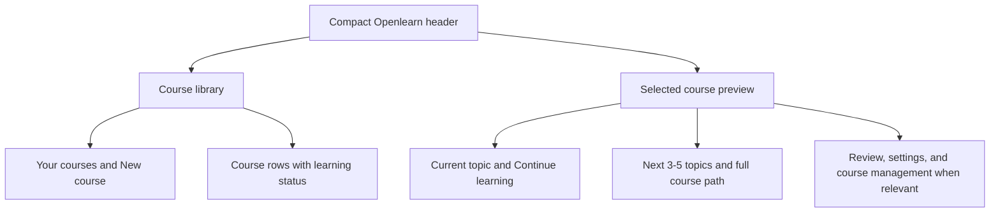
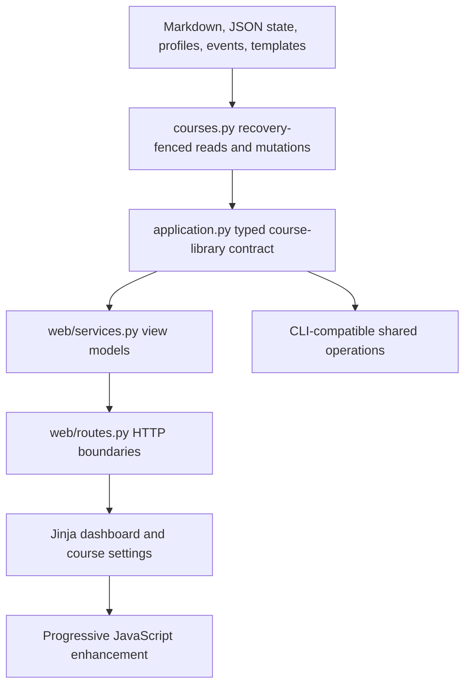
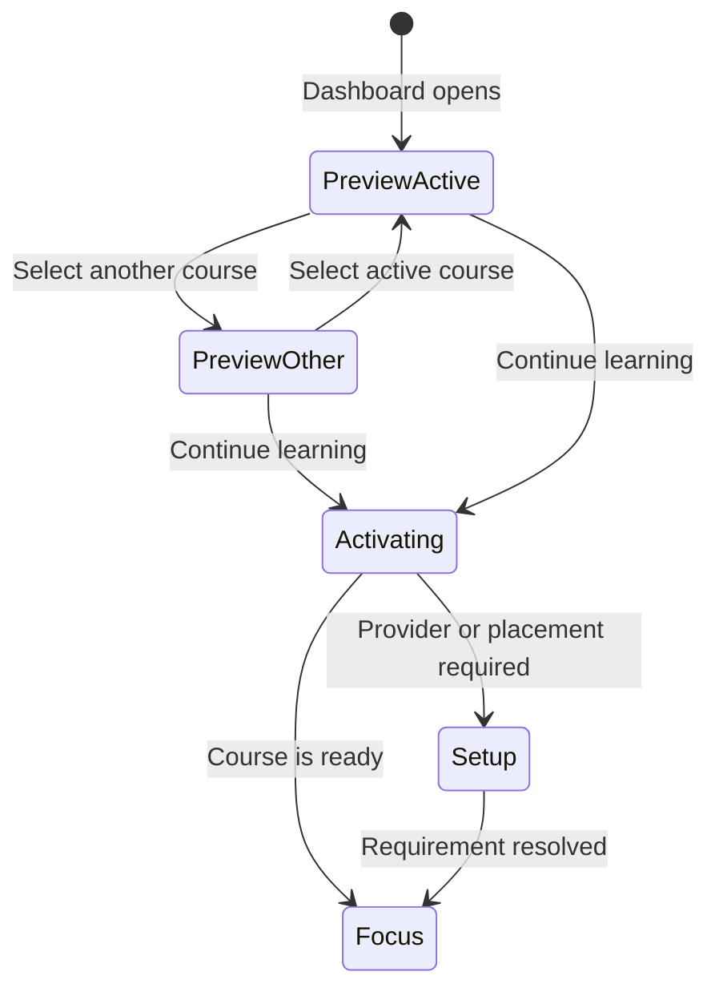

# Course Library Dashboard - Plan

## Goal Capsule

- **Objective:** Make the Openlearn home page an intuitive course library and learning launch point where a learner can see what to study, preview or resume a course, and manage course settings without understanding the product's internal machinery.
- **Product authority:** This plan owns the web dashboard, course preview and path entry, course-level management, actionable review visibility, and completed-course follow-up experience.
- **Open blockers:** None.

---

## Product Contract

### Summary

Openlearn will present a course library beside a selected-course preview that gives the learner one obvious next learning action.
The dashboard will combine upcoming course topics, meaningful learning status, course management, and completed-course follow-up while removing duplicated or unactionable interface boxes.

### Problem Frame

The current home page emphasizes a generic resume card, repeats navigation destinations in separate dashboard boxes, and keeps an empty review panel visible when no review is due.
Course rows open the learning workspace immediately, so a learner cannot inspect another course before switching context.
The web interface also lacks course-level settings and permanent deletion even though course deletion exists in the CLI.
Together, these gaps make learners reason about the application instead of immediately understanding what they can learn next.

### Key Decisions

- **Course library plus selected path** (session-settled: user-directed - chosen over a single focused runway and a broad learning studio: it keeps navigation and course context together). Governs R1-R5, R17.
- **Preview before entry** (session-settled: user-directed - chosen over immediately activating a selected course: browsing should not interrupt the current learning context). Governs R3-R5.
- **Learning status over generic completion percentage** (session-settled: user-directed - chosen because current topic, coverage, weak areas, and review needs better describe useful progress). Governs R6-R9.
- **Permanent deletion without an archive state** (session-settled: user-directed - chosen over archive-first management: the desired course lifecycle should stay simple). Governs R13.
- **Hybrid specialized follow-up courses** (session-settled: user-directed - chosen over only curated or only generated recommendations: use a trusted specialty course when one exists and personalize otherwise). Governs R10-R12.

### Intended Layout

On wider screens, the course library and selected-course preview appear as adjacent parts of one workspace.
On narrow screens, the course library appears first and the selected preview follows without reducing either surface to a cramped column.

### Requirements

**Course library and entry**

- R1. The primary dashboard surface must contain the `Your courses` heading and `New course` action inside the course library panel.
- R2. A learner with no courses must see starter choices directly inside the empty course library, with Technical Interview Prep first and the initial visible choices spanning meaningfully different subject areas.
- R3. Selecting a course must update the selected-course preview without changing the active course or opening the learning workspace.
- R4. The selected-course preview must make `Continue learning` the deliberate action that opens or resumes that course.
- R5. The current active course must remain easy to identify and resume even after the learner previews a different course.

**Learning path and status**

- R6. Each course row must summarize the current topic, first-pass topic coverage, and whether review work is due instead of relying on a generic percentage alone.
- R7. The selected-course preview must show the current topic and the next three to five planned topics in course order.
- R8. The selected-course preview must provide a `View full course path` action that reveals the broader course sequence without starting a lesson.
- R9. Review work must appear on the landing page only when it is actionable, and the dashboard must not reserve a persistent empty panel for a zero-review state.

**Completion and continued growth**

- R10. Completed courses must remain in the course library and distinguish first-pass completion from full readiness or mastery.
- R11. A completed course with weak or uncertain concepts must offer focused review and an option to go deeper on those concepts.
- R12. A completed course must recommend a more advanced course that specializes in a relevant part of the original course, preferring a curated specialty course when available and otherwise offering a tutor-generated focused follow-up based on the learner's weak areas or stated interests.

**Course creation and management**

- R13. Course management must support permanent deletion through a consequence-focused confirmation and offer the existing verified whole-home backup flow before the final destructive action.
- R14. Course settings must let the learner edit the course name, goal, pace, difficulty, outline, and course-specific learning details such as interview role or target date when those fields apply.
- R15. Course settings must present learner-facing controls and must not expose raw mastery records, internal cursor state, event logs, or other storage implementation details.
- R16. `New course` must offer Starter course, Custom course, and Quick Learn as related creation choices, replacing Quick Learn as a competing dashboard box or primary navigation destination.

**Interface hierarchy and resilience**

- R17. The primary navigation must use a compact, visually formatted hierarchy without the current raw category labels or duplicated dashboard entry boxes for Quick Learn and Settings or data.
- R18. Settings, provider, and data controls must remain reachable as secondary utilities without competing with learning actions on the home page.
- R19. The dashboard must preserve the library-and-preview hierarchy across desktop and narrow layouts, with no clipped controls, horizontal scrolling, or squeezed unreadable panels.
- R20. Course selection, path disclosure, creation, settings, and deletion must support keyboard navigation, visible focus, clear selected state, and screen-reader labels that describe the action rather than the implementation.
- R21. If a selected course cannot continue because setup, provider recovery, or another learner action is required, the preview must explain the blocker in context and offer the narrow recovery action without replacing the rest of the course overview.

### Key Flows

- F1. First course selection
  - **Trigger:** A learner opens Openlearn without any courses.
  - **Steps:** The course library displays varied starter choices and the New course action; the learner selects a starter or creation path; Openlearn continues through the applicable setup flow.
  - **Outcome:** The learner reaches a course without first navigating an empty or duplicated dashboard.
  - **Covers:** R1, R2, R16-R20.

- F2. Preview and resume another course
  - **Trigger:** A returning learner selects a course row that is not currently active.
  - **Steps:** The preview changes to that course; the current topic, learning status, and upcoming path become visible; the active course remains unchanged until the learner chooses Continue learning.
  - **Outcome:** The learner can compare context before deliberately entering the course.
  - **Covers:** R3-R8, R17-R21.

- F3. Manage or delete a course
  - **Trigger:** A learner opens course management from the selected preview.
  - **Steps:** The learner edits supported learning controls or chooses permanent deletion; deletion explains the impact and offers a verified backup before requiring final confirmation.
  - **Outcome:** Settings changes remain course-scoped, while confirmed deletion removes only the selected course and its owned learning data.
  - **Covers:** R13-R15, R18, R20.

- F4. Continue after first-pass completion
  - **Trigger:** A learner selects a completed course.
  - **Steps:** The preview distinguishes completed coverage from remaining weak or due work; it offers focused review and a relevant advanced specialty follow-up; the learner chooses whether to review, deepen, or start the follow-up.
  - **Outcome:** Completion becomes a useful transition rather than a dead end or a false claim of mastery.
  - **Covers:** R9-R12.

### Acceptance Examples

- AE1. Empty library
  - **Covers R1, R2, R16.**
  - **Given:** A new learner has no courses.
  - **When:** The learner opens the dashboard.
  - **Then:** The Courses panel immediately shows Technical Interview Prep, varied starter choices, Custom course, and Quick Learn access without a separate `Start something new` button.

- AE2. Non-destructive course preview
  - **Covers R3-R5, R7, R8.**
  - **Given:** A learner is active in Course A and Course B also exists.
  - **When:** The learner selects Course B in the course library.
  - **Then:** Course B's preview and next topics appear, Course A remains active, and Course B opens only after Continue learning is chosen.

- AE3. Actionable review visibility
  - **Covers R6, R9.**
  - **Given:** No course has a review due.
  - **When:** The learner opens the dashboard.
  - **Then:** No empty review panel or `0 due` status box is shown.

- AE4. Review becomes visible
  - **Covers R6, R9, R21.**
  - **Given:** A course has review work due.
  - **When:** The learner opens or selects that course.
  - **Then:** The course row and preview show the actionable review state and provide a direct review action.

- AE5. Permanent course deletion
  - **Covers R13.**
  - **Given:** A learner selects permanent deletion for one course.
  - **When:** The learner reaches the confirmation step.
  - **Then:** The interface identifies the exact course and affected local data, links to the verified backup flow, and performs no deletion until the learner confirms the destructive action.

- AE6. Completed course with weak areas
  - **Covers R10-R12.**
  - **Given:** A course has completed first-pass coverage and still has weak concepts.
  - **When:** The learner selects the completed course.
  - **Then:** The preview offers focused review or deeper work and recommends an advanced specialty course without representing the learner as fully ready.

- AE7. Narrow layout
  - **Covers R19, R20.**
  - **Given:** The dashboard is opened at a narrow viewport or with increased text size.
  - **When:** The learner navigates the course library and preview.
  - **Then:** The surfaces stack in reading order, every action remains reachable, and no learning status or upcoming topic is clipped.

### Success Criteria

- A first-time learner can choose a useful starting course from the home page without needing an explanation of Openlearn's navigation model.
- A returning learner can identify what they are learning now, what comes next, and the primary action to continue within one dashboard scan.
- A learner can inspect, switch, configure, create a verified backup, or permanently delete a course without affecting unrelated courses.
- The home page contains no duplicated Quick Learn, Settings, data, or empty-review entry boxes.
- Completed courses lead to concrete review, deepening, or specialization choices instead of becoming inert history.

### Scope Boundaries

**Deferred for later**

- Community template search, ratings, likes or dislikes, and shared course discovery.
- Embedded code editors, video players, music notation tools, and other specialized learning workspaces.
- A native mobile application, while keeping this dashboard responsive enough to inform a later mobile experience.
- Course archiving, trash, restore, and multi-stage retention states.

**Outside this work**

- Raw editing of mastery evidence, spaced-repetition state, tutor event history, or curriculum cursor internals.
- A redesign of the active lesson workspace beyond the dashboard-to-course entry and return behavior required by this plan.
- Hosted subscriptions, account management, billing, or shared cloud course state.

### Dependencies and Assumptions

- Existing course progress, accepted curriculum paths, review state, and completed-course evidence remain the authorities for dashboard projections.
- Changing learner-facing course settings preserves earned learning evidence unless the learner separately chooses an explicitly destructive reset.
- The experience remains local-first and must not require an account or hosted service to manage courses.
- Curated advanced follow-up courses may be added incrementally, so the recommendation experience must remain useful when only the tutor-generated fallback is available.
- Permanent deletion applies only to data owned by the selected course and must preserve all unrelated courses and global provider configuration.

### Sources and Research

- `src/openlearn/web/templates/dashboard.html` shows the current unconditional review panel, direct course links, and duplicated workbench entry boxes.
- `src/openlearn/web/templates/base.html` shows the current grouped primary navigation and duplicated Quick Learn and utility destinations.
- `src/openlearn/web/routes.py` and `src/openlearn/web/schemas.py` confirm that the web layer has no general course-settings or per-course deletion workflow.
- `src/openlearn/cli.py` confirms that permanent single-course deletion already exists in the CLI.
- `src/openlearn/application.py` and `src/openlearn/web/services.py` show that completed-course and canonical learning state exist but are not fully projected into the dashboard experience.
- `docs/plans/2026-08-07-004-feat-local-web-tutor-mvp-plan.md` provides the original dashboard hierarchy and local-first web constraints this work extends.

Product Contract preservation: changed R13, F3, AE5, and the related success criterion to clarify that the pre-deletion safeguard is Openlearn's existing verified whole-home backup rather than a new per-course export format.

---

## Planning Contract

### Key Technical Decisions

- KTD1. **One presentation-independent course-library projection.** `application.py` and `courses.py` will own immutable selected-course, active-course, path, progress, readiness, blocker, and recommendation projections; `web/services.py` will adapt them once for templates and JSON.
  This preserves the existing transcript-free dashboard contract and prevents Jinja or JavaScript from inventing learning state.
- KTD2. **URL-backed preview and explicit activation.** Course selection will be a read-only canonical-slug query, while `Continue learning` will use a CSRF-protected POST that activates the course and routes to setup, placement, initialization, recovery, or focus as appropriate.
  This is session-settled: user-approved - chosen over activating a course row immediately because browsing must not interrupt the learner's active context.
- KTD3. **Canonical, revision-fenced settings updates.** A stable slug will remain the storage identity; name and goal update learner-facing metadata, difficulty maps to the existing `efficient`/`proficient`/`deep` mastery profiles, pace maps to weekly and session minutes, and outline changes use preview then confirmation.
  Frontmatter is the canonical title and goal authority; confirmation updates the generated H1 and `Current Goal` body sections only when they still match the prior generated values, preserves all learner-authored body content, and excludes conflicting stale generated text from tutor context.
  Generic and interview courses will share one application boundary while retaining their existing storage-specific reconciliation and evidence-preservation rules.
  Multi-store settings confirmation will use one submission ID and payload hash, fixed lock ordering, expected revisions for every touched store, a durable journal and receipt, deterministic replay, and recovery at each publication checkpoint.
- KTD4. **Existing tombstone-backed deletion and verified backup.** Web deletion will wrap the existing locked course-deletion primitive, clear only the deleted active selection, preserve global learner/provider state, and route the learner to the existing verified backup flow before confirmation.
  This is session-settled: user-approved - chosen over inventing a per-course archive because R13 requires a safe backup opportunity, not a new portable format.
- KTD5. **Deterministic recommendations with explicit generation.** Dashboard reads will rank curated follow-up templates from static specialization metadata without a model call; if no curated match exists, the interface will offer an explicit provider-backed proposal action and require confirmation before creating a course.
  A target template may declare validated `specializes_template_ids` and `specializes_tags`; ranking prefers an exact source-template relationship, then weak-area tag overlap, then the catalog's stable display order.
- KTD6. **Progressive, server-rendered interaction.** Real links, forms, native disclosure controls, visible focus, and semantic selected state will provide the baseline; JavaScript will enhance selection, preview, form submission, announcements, and responsive focus restoration without owning source-of-truth state.
  The compact header will show Openlearn's home identity on the left and one labeled `Utilities` menu on the right containing Tutor connection, App settings, and Data and backup; course creation and Quick Learn remain exclusively inside the course-library workflow.
- KTD7. **Review and deepening remain distinct actions.** Due review links to gradeable scheduled work, while weak-area practice or deeper study uses the canonical course progression boundary and never fabricates a due-review count.

### High-Level Technical Design

The selected course is URL state and never changes the active course during a GET.
Activation is an explicit mutation and becomes the only dashboard route into the learning workspace.
Settings and deletion use expected revision or generation values so stale tabs cannot overwrite a newer course state.

### System-Wide Impact

- **Read path:** Dashboard reads must remain side-effect-free, recovery-fenced, and transcript-free, including for interview courses.
- **Write path:** Activation, settings confirmation, generated follow-up creation, and deletion are separate idempotent mutations with CSRF/origin protection and stale-state handling.
- **Storage:** The Markdown plus JSON split remains intact; the stable slug is never renamed; course-owned artifacts are deleted under existing locks and tombstones.
- **Tutor behavior:** Updated goal, pace, difficulty, interview profile, and accepted outline must enter tutor context through canonical existing metadata rather than UI-only fields.
- **Interfaces:** Shared application operations preserve CLI and web behavior even though this delivery primarily changes the web workflow.
- **Performance:** Dashboard projections must not parse session logs or contact a model/provider; full path and recommendation data are computed from local accepted curriculum and template metadata.
- **Accessibility:** Selection, disclosure, activation, settings, and destructive confirmation remain usable without pointer input or animation.

### Risks and Mitigations

| Risk | Impact | Mitigation |
| --- | --- | --- |
| Generic and interview courses drift into separate dashboard behavior | Learners see inconsistent paths and settings | Project both through typed shared DTOs and test matching interface semantics with storage-specific fixtures. |
| A dashboard GET mutates active state or learner metrics | Previewing a course changes learning context | Keep selection URL-backed and read-only; test state bytes before and after preview. |
| Settings overwrite earned evidence or stale concurrent changes | Learner progress is lost | Use revision fences, active-operation checks, preview-confirm outline reconciliation, and preservation tests. |
| Deletion misses owned artifacts or clears unrelated global state | Data loss or course resurrection | Reuse tombstones and canonical locks, inventory course-owned paths, test active-course and concurrent-worker deletion. |
| Recommendation rendering triggers provider cost | Landing page becomes slow or surprising | Keep ranking deterministic and local; make generation an explicit action with provider readiness handling. |
| Responsive enhancement obscures the selected preview | Mobile and keyboard workflows become confusing | Preserve a complete no-JS route, stack library first, restore focus predictably, and run viewport/browser assertions. |

### Sequencing

U1 defines the read contract consumed by all later units.
U2 and U3 add mutations only after that contract can describe their outcomes.
U4 builds completion and growth actions on the same projections.
U5 replaces the web hierarchy after the domain boundaries are stable.
U6 finishes responsive interaction, browser validation, and release documentation.

---

## Implementation Units

### U1. Canonical course-library projection

- **Goal:** Provide one side-effect-free typed projection for the course list and selected-course preview, including active identity, current and upcoming path, full path, first-pass coverage, actionable review, weak areas, completion, blockers, and local recommendation candidates.
- **Requirements:** R3-R12, R21; F2, F4; AE2-AE4, AE6.
- **Dependencies:** None.
- **Files:** `src/openlearn/application.py`, `src/openlearn/courses.py`, `src/openlearn/course_templates.py`, `tests/test_application.py`, `tests/test_courses.py`.
- **Approach:** Extend the immutable application DTOs instead of returning raw metadata dictionaries.
  Resolve the requested selected slug without activating it, preserve a distinct active slug and resume candidate, derive generic paths from `course_units` with `template_units` fallback, and derive interview paths from the pinned canonical route.
  Count accepted route skills for interview first-pass coverage and keep due, weak, deferred, and verify work separate from coverage.
  Add explicit optional template specialization metadata and deterministic local recommendation ranking.
- **Patterns:** Follow `CourseCard`, `CourseSnapshot`, `DashboardSnapshot`, `_recovery_fenced_course_source()`, `interview_learning_card_projection()`, and `_learning_progress()`.
- **Test Scenarios:**
  1. Selecting Course B while Course A is active returns B as selected and A as active without changing any state file or learning metric.
  2. Generic and interview fixtures return current plus next three to five ordered items and a complete path with stable identities.
  3. Interview coverage uses the accepted route denominator, distinguishes readiness, and excludes deselected optional skills.
  4. Due review is actionable only when the course has gradeable due items; zero due returns no review action.
  5. Completed and weak-area projections recommend a curated specialty when declared and a generated-proposal affordance otherwise, without provider calls.
  6. Dashboard projection never parses a transcript or session history.
- **Verification:** Run `tests/test_application.py` and `tests/test_courses.py` with the repository test environment.

### U2. Course activation and settings transactions

- **Goal:** Add explicit activation and learner-facing course settings that preserve storage identity, evidence, and concurrent changes.
- **Requirements:** R3-R5, R14, R15, R21; F2, F3; AE2.
- **Dependencies:** U1.
- **Files:** `src/openlearn/application.py`, `src/openlearn/courses.py`, `src/openlearn/interview_prep.py`, `src/openlearn/cli.py`, `src/openlearn/web/schemas.py`, `tests/test_application.py`, `tests/test_courses.py`, `tests/test_interview_prep.py`.
- **Approach:** Add output-free application operations for activation, settings preview, and settings confirmation.
  Activation will use a lock-protected global-state update that changes only active course identity, preserves every other key, and does not call `set_active_topic()` or record study dates and streaks before real learning activity occurs.
  Keep the slug immutable, update title and goal through the Markdown plus JSON boundary, map difficulty to the existing mastery profile, and map pace to bounded weekly/session minutes.
  Treat frontmatter as the canonical title and goal, update only recognized generated H1 and `Current Goal` body sections that still match their prior generated values, preserve all learner-authored prose, and omit conflicting stale generated text from tutor context.
  Reuse interview profile normalization and canonical route preview/acceptance for interview-specific fields and outline changes.
  Extract the persistence portion of generic scope changes so outline confirmation preserves known/weak/review evidence and retains the current item when its stable identity survives.
  Publish settings through a recoverable transaction with one submission ID and payload hash, fixed lock ordering, expected revisions for each store, a durable journal and receipt, deterministic replay, and reject mutations while a conflicting tutor operation is active.
- **Patterns:** Follow `save_course_options()`, `save_scope_change()`, `normalize_profile_update()`, `preview_interview_curriculum_change()`, and `accept_interview_curriculum()` without invoking interactive CLI handlers from web code.
- **Test Scenarios:**
  1. Activation changes only the active slug and returns the correct setup, placement, initialization, recovery, or focus destination.
  2. Previewing settings writes nothing; confirming the same request is idempotent.
  3. Renaming changes the display name but not the slug or artifact paths.
  4. Pace and difficulty changes enter subsequent tutor context through canonical fields.
  5. Generic and interview outline edits require preview and preserve compatible evidence while leaving removed evidence auditable but inactive.
  6. Stale revisions and active-operation conflicts fail without partial writes.
  7. Fault injection after every settings publication checkpoint recovers one complete state, and identical replay returns the existing receipt while a changed payload conflicts.
  8. Title and goal confirmation updates recognized generated sections without overwriting learner-authored body notes or leaking stale duplicate context to the tutor.
- **Verification:** Run the affected application, courses, interview-prep, and CLI-focused settings tests.

### U3. Guarded permanent deletion and backup handoff

- **Goal:** Expose permanent course deletion safely while preserving unrelated courses, learner state, and provider configuration.
- **Requirements:** R13, R15, R18, R20; F3; AE5.
- **Dependencies:** U1.
- **Files:** `src/openlearn/application.py`, `src/openlearn/courses.py`, `src/openlearn/cli.py`, `src/openlearn/web/schemas.py`, `tests/test_application.py`, `tests/test_courses.py`, `tests/test_cli.py`.
- **Approach:** Wrap `delete_topic_files()` in a typed course deletion operation with exact slug/title confirmation, expected generation, and a safe next selection.
  Inventory all course-owned artifacts, including drills and private operation data, under the existing locks and tombstone protocol.
  Clear the deleted slug from active selection without resetting unrelated global state or streak data.
  Treat the existing verified whole-home backup workflow as a separate pre-deletion action rather than coupling backup creation to deletion.
- **Patterns:** Follow existing deletion tombstones, lock ordering, topic data-directory cleanup, and `data_management.create_backup()` verification.
- **Test Scenarios:**
  1. Wrong title or slug confirmation performs no deletion.
  2. Deleting the active course chooses a safe remaining preview and preserves unrelated global state.
  3. All owned artifacts disappear while unrelated courses and provider config remain byte-for-byte unchanged.
  4. A concurrent tutor operation cannot resurrect a tombstoned course.
  5. Repeating a successful deletion is safe and a stale generation cannot delete a recreated course.
- **Verification:** Run focused deletion, tombstone, backup, and application tests.

### U4. Review, deepening, and specialty follow-up actions

- **Goal:** Make first-pass completion a useful transition into due review, weak-area practice, deeper study, or a specialized follow-up course.
- **Requirements:** R9-R12, R21; F4; AE3, AE4, AE6.
- **Dependencies:** U1, U2.
- **Files:** `src/openlearn/application.py`, `src/openlearn/courses.py`, `src/openlearn/course_templates.py`, `src/openlearn/tutor_service.py`, `src/openlearn/web/schemas.py`, `tests/test_application.py`, `tests/test_courses.py`, `tests/test_tutor_service.py`.
- **Approach:** Add course-scoped review and canonical practice/deepening intents without converting readiness work into scheduled-review counts.
  Extend the strict template schema with target-owned `specializes_template_ids` and `specializes_tags`, validate referenced template IDs and normalized tags, and rank exact source-template matches before weak-area tag overlap and stable catalog order.
  When no curated match exists, expose an explicit proposal operation that uses weak labels and learner interests, persists an idempotent draft, and creates nothing until confirmation.
  Proposal generation will expose an accessible pending state without replacing course context, disable duplicate submissions, preserve a recoverable inline provider error with retry, and announce completion before the confirmation action becomes available.
- **Patterns:** Follow `due_reviews()`, canonical interview `intent="practice"`, tutor operation receipts, provider readiness gates, and existing course-creation transactions.
- **Test Scenarios:**
  1. Zero actionable reviews produce no CTA; one due item links to the selected course's gradeable review.
  2. Weak-area practice does not award mastery merely by opening the lesson.
  3. First-pass completion can coexist with readiness work and never claims full mastery.
  4. Curated recommendation ranking is deterministic and model-free.
  5. Generated fallback requires provider readiness, replays idempotently, and creates a course only after confirmation.
  6. Delayed generation, provider failure, retry, and duplicate clicks preserve the selected course and result in at most one proposal operation.
- **Verification:** Run focused application, course-template, tutor-service, and course-creation tests.

### U5. Course library, preview, settings, and deletion web surfaces

- **Goal:** Replace the current landing hierarchy with the settled library-plus-preview layout and connect all domain operations through thin web boundaries.
- **Requirements:** R1-R18, R21; F1-F4; AE1-AE6.
- **Dependencies:** U1-U4.
- **Files:** `src/openlearn/web/app.py`, `src/openlearn/web/routes.py`, `src/openlearn/web/schemas.py`, `src/openlearn/web/services.py`, `src/openlearn/web/templates/base.html`, `src/openlearn/web/templates/dashboard.html`, `src/openlearn/web/templates/course_settings.html`, `tests/test_web.py`, `tests/test_web_security.py`.
- **Approach:** Render the dashboard from a requested canonical selected slug with deterministic fallback to active, resume, then first course.
  Keep `Your courses` and `New course` inside the library panel, make rows preview controls rather than focus links, render each row's current topic, first-pass coverage, and actionable review status, render the selected path and blocker, and submit activation only from `Continue learning`.
  Render completed courses with separate first-pass and readiness language plus the focused review, deepening, and specialty follow-up actions from U4.
  Use a native disclosure for the full path and ordinary forms for the no-JavaScript settings and deletion baseline.
  Remove Quick Learn as a primary competitor while keeping it under New course, and collapse provider/data/settings into a compact utility surface.
  Render Openlearn home identity at the left of the compact header and one labeled `Utilities` menu at the right with Tutor connection, App settings, and Data and backup.
- **Patterns:** Follow existing Jinja macros, security middleware, CSRF/origin handling, `requestJson()` response envelopes, and provider/setup redirects.
- **Test Scenarios:**
  1. Empty dashboard renders varied starter choices with Technical Interview Prep first and no duplicate start button.
  2. Course selection changes preview but not active state; Continue activates once and redirects correctly.
  3. Dashboard hides zero-review and duplicate Quick Learn/settings/data panels.
  4. Settings preview, confirmation, stale conflict, and validation errors preserve learner input.
  5. Deletion page names the exact course, links to backup, requires explicit confirmation, and returns a safe dashboard selection.
  6. New mutation endpoints reject missing CSRF, invalid origin, oversized input, and unsafe rendered text.
  7. Course rows render current topic, first-pass coverage, and actionable review state, while a completed selected course exposes readiness, weak-area, and specialty follow-up actions.
- **Verification:** Run `tests/test_web.py` and `tests/test_web_security.py`.

### U6. Responsive interaction, accessibility, and release polish

- **Goal:** Make the new dashboard feel fast, obvious, and stable across keyboard, desktop, narrow, increased-text, reduced-motion, and no-JavaScript use.
- **Requirements:** R1-R21; F1-F4; AE1-AE7.
- **Dependencies:** U5.
- **Files:** `src/openlearn/web/static/openlearn.css`, `src/openlearn/web/static/openlearn.js`, `src/openlearn/web/templates/dashboard.html`, `src/openlearn/web/templates/course_settings.html`, `tests/test_web_browser.py`, `manual-tests/public-release.md`.
- **Approach:** Progressively enhance real preview links/forms so selection updates the URL/history, selected row state, and preview announcement without activating the course.
  Keep focus on the selected row on wide layouts and provide a deliberate jump to the preview on narrow layouts.
  Reuse the existing makerspace palette and motion tokens, use layout-stable CSS transitions only where they add clarity, and honor reduced motion immediately.
  Remove the unformatted category nav and bottom boxes rather than restyling redundant information.
- **Patterns:** Follow `announce()`, `requestJson()`, existing focus restoration, `prefers-reduced-motion`, and `_assert_no_page_overflow()`.
- **Test Scenarios:**
  1. Keyboard-only selection, full-path disclosure, Continue, settings, backup link, and deletion confirmation work with visible focus.
  2. Browser history and reload preserve the selected preview without changing active course.
  3. Desktop, 760px, 320px, and increased-text layouts have no horizontal overflow, clipped controls, or squeezed preview content.
  4. Reduced motion disables transitional movement while preserving immediate state and focus.
  5. No-JavaScript selection and forms complete the same core workflows.
  6. Empty, active, blocked, due-review, completed, weak-area, and deleted-course states remain visually coherent.
  7. Follow-up generation shows pending, recoverable failure, retry, and completion states without hiding the selected-course context or accepting duplicate submissions.
- **Verification:** Run the focused Playwright browser module and complete the updated manual release journey with an isolated `OPENLEARN_HOME`.

---

## Verification Contract

| Gate | Command or evidence | Covers |
| --- | --- | --- |
| Domain projections | Focused `pytest` runs for `tests/test_application.py` and `tests/test_courses.py` | U1-U4 |
| Tutor, interview, and CLI mutation behavior | Focused `pytest` runs for `tests/test_interview_prep.py`, `tests/test_tutor_service.py`, and relevant settings and deletion selectors in `tests/test_cli.py` | U2-U4 |
| Web service and security | Focused `pytest` runs for `tests/test_web.py` and `tests/test_web_security.py` | U5 |
| Browser behavior | Playwright-enabled `pytest` run for `tests/test_web_browser.py` | U6 |
| Static quality | Ruff on all changed Python files, Python compilation, JavaScript syntax check, and `git diff --check` | U1-U6 |
| Repository green gate | `make check` | U1-U6 |
| Pre-landing review gate | `make review` | U1-U6 |
| Human release journey | Updated `manual-tests/public-release.md` using an isolated learner home | U5, U6 |

All mutation tests must reload state from disk through a fresh application or service instance and assert persisted outcomes, not only returned view models.
All dashboard read tests must assert that selection is non-mutating and does not parse transcripts or contact a provider.
Deletion tests must use isolated temporary learner homes and must never target real learner data.

---

## Definition of Done

- U1-U6 satisfy every cited requirement, flow, and acceptance example without weakening the local-first storage contract.
- The dashboard has one clear course-library and selected-preview hierarchy, with `Your courses` and `New course` inside the library panel.
- Previewing a course cannot activate it; `Continue learning` is the only dashboard activation action.
- Course settings persist real tutor behavior, preserve compatible evidence, reject stale writes, and keep the slug stable.
- Permanent deletion uses existing tombstones and locks, offers the verified backup flow, preserves unrelated state, and cannot be undone accidentally through stale work.
- Reviews appear only when gradeable work exists, while weak-area deepening and specialty recommendations remain available through separate explicit actions.
- The raw category navigation and duplicated bottom Quick Learn/settings/data boxes are gone without making their capabilities unreachable.
- Keyboard, reduced-motion, no-JavaScript, narrow-screen, and increased-text journeys are verified.
- `make check` and `make review` pass, and the manual release workflow records no unresolved blocker.
- Changed code has been simplified and independently reviewed before the implementation branch is committed and handed off.

---

## Appendix

### Deferred Follow-Up Work

- A portable per-course export and restore format may be planned separately if learners need to share or move individual courses.
- Community template discovery, rating, and ranking remains a post-release feature.
- Natural-language course management can layer on the same application operations after the explicit controls are proven.
- Mobile-native navigation can reuse the library and preview contract after the responsive web workflow is stable.
